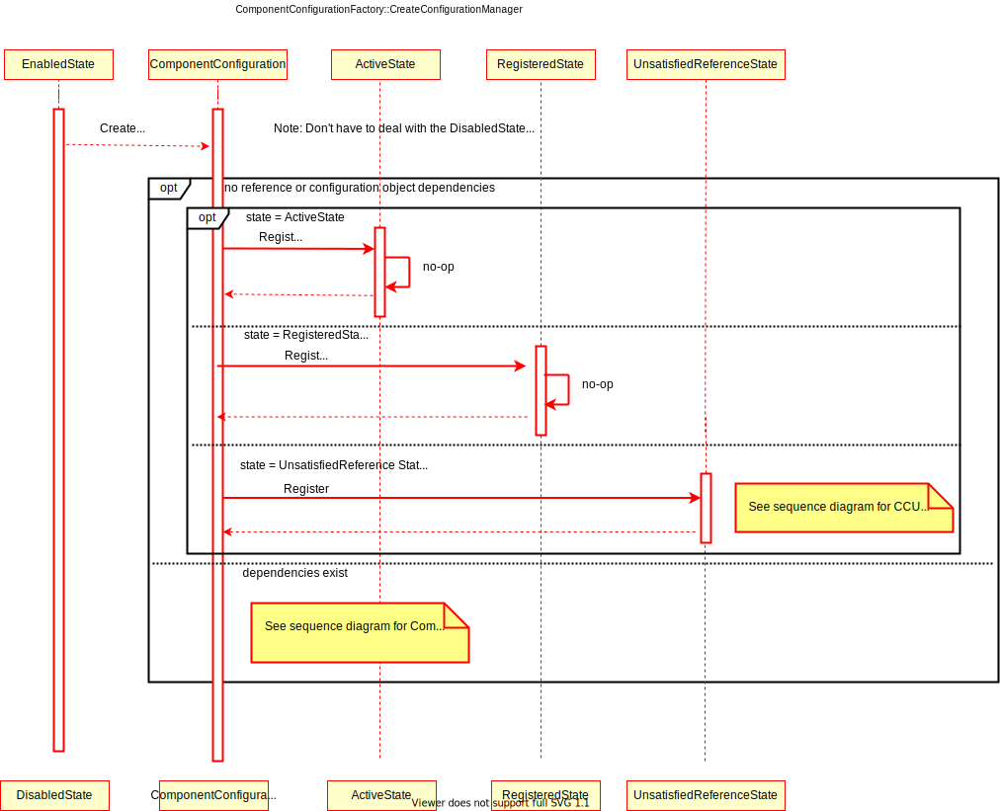
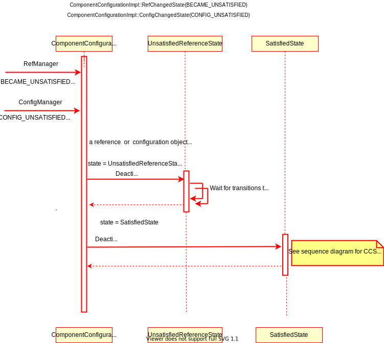

- Start Date: 2021-10-12
- RFC PR: (in a subsequent commit to the PR, fill me with the PR's URL)
- CppMicroServices Issue: 

# Integration of Configuration Admin into Declarative Services
    - Authors : Patty Elliott

Table of Contents
=================

- [Integration of Configuration Admin into Declarative Services](#integration-of-configuration-admin-into-declarative-services)
  * [Summary](#summary)
  * [Motivation](#motivation)
    + [Requirements Analysis](#requirements-analysis)
    + [User Roles and Goals](#user-roles-and-goals)
    + [Use Cases](#use-cases)
      - [UC1: C++ Service Author](#uc1--c---service-author)
      - [UC2: C++ Service Consumer](#uc2--c---service-consumer)
    + [Pain Point Summary](#pain-point-summary)
    + [Requirements](#requirements)
      - [Out of Scope](#out-of-scope)
  * [Functional Design](#functional-design)
    + [Functional Design Summary](#functional-design-summary)
    + [Proposed Design Details - Declarative Services](#proposed-design-details---declarative-services)
      - [JSON Specification](#json-specification)
        * [Schema and Example](#schema-and-example)
        * [Example](#example)
      - [Component Activation](#component-activation)
      - [Component Activation - configuration-policy = require](#component-activation---configuration-policy---require)
        * [Used when inject-references = true](#used-when-inject-references---true)
        * [Used when inject-references = false](#used-when-inject-references---false)
        * [Multiple configuration object dependencies - rules of precedence](#multiple-configuration-object-dependencies---rules-of-precedence)
      - [Component Activation - configuration-policy = optional](#component-activation---configuration-policy---optional)
      - [Component Activation - configuration-policy = ignore](#component-activation---configuration-policy---ignore)
    + [Configuration changes](#configuration-changes)
      - [Modified Method API](#modified-method-api)
        * [Exception Handling:](#exception-handling-)
    + [Configuration changes - configuration-policy = require](#configuration-changes---configuration-policy---require)
    + [Configuration changes - configuration-policy= optional](#configuration-changes---configuration-policy--optional)
    + [Configuration changes = configuration-policy = ignore](#configuration-changes---configuration-policy---ignore)
    + [Providing configuration properties to the component instance.](#providing-configuration-properties-to-the-component-instance)
    + [Configuration Listener](#configuration-listener)
    + [Factory Pid support](#factory-pid-support)
    + [Design Case 1: C++ Service Consumer](#design-case-1--c---service-consumer)
      - [BundleA](#bundlea)
      - [Service Consumer code for BundleA](#service-consumer-code-for-bundlea)
    + [Design Case 2: C++ Service Author](#design-case-2--c---service-author)
      - [FactoryComponentBundle](#factorycomponentbundle)
      - [Service Author code for creating a factory instance](#service-author-code-for-creating-a-factory-instance)
  * [Proposed Design Details - Configuration Admin](#proposed-design-details---configuration-admin)
    + [ListConfigurations](#listconfigurations)
    + [Configuration Listener](#configuration-listener-1)
    + [Update, UpdateIfDifferent, Remove](#update--updateifdifferent--remove)
  * [Alternate Designs Considered](#alternate-designs-considered)
  * [Architectural Design](#architectural-design)
    + [Architecturally Significant Design Case(s)](#architecturally-significant-design-case-s-)
    + [Functional Units](#functional-units)
    + [Class Design - existing classes](#class-design---existing-classes)
      - [SCRActivator](#scractivator)
      - [SCRBundleExtension](#scrbundleextension)
      - [ComponentConfigurationImpl](#componentconfigurationimpl)
        * [ComponentConfigurationImpl constructor](#componentconfigurationimpl-constructor)
        * [ComponentConfigurationImpl::Initialize](#componentconfigurationimpl--initialize)
        * [ComponentConfigurationImpl::GetProperties](#componentconfigurationimpl--getproperties)
        * [ComponentConfigurationImpl::ConfigChangedState](#componentconfigurationimpl--configchangedstate)
        * [SetRegistrationProperties](#setregistrationproperties)
        * [ComponentConfigurationImpl::Stop](#componentconfigurationimpl--stop)
        * [ComponentConfigurationImpl::AreReferencesSatisfied](#componentconfigurationimpl--arereferencessatisfied)
        * [ComponentConfigurationImpl::Modified](#componentconfigurationimpl--modified)
        * [ComponentConfigurationImpl::ModifyComponentInstanceProperties](#componentconfigurationimpl--modifycomponentinstanceproperties)
      - [ComponentMetadata](#componentmetadata)
    + [Class Design - new classes](#class-design---new-classes)
      - [Configuration Manager](#configuration-manager)
        * [ConfigurationManager::Initialize](#configurationmanager--initialize)
        * [ConfigurationManager::UpdateMergedProperties](#configurationmanager--updatemergedproperties)
        * [ConfigurationManager::IsConfigSatisfied](#configurationmanager--isconfigsatisfied)
      - [ConfigurationNotifier](#configurationnotifier)
        * [ConfigurationNotifier::RegisterListener](#configurationnotifier--registerlistener)
        * [ConfigurationNotifier::UnregisterListener](#configurationnotifier--unregisterlistener)
        * [ConfigurationNotifier::NotifyAllListeners](#configurationnotifier--notifyalllisteners)
        * [ConfigurationNotifier::AnyListenersForPid](#configurationnotifier--anylistenersforpid)
        * [CreateFactoryComponent](#createfactorycomponent)
      - [ConfigurationListenerImpl](#configurationlistenerimpl)
        * [ConfigurationListenerImpl::configurationEvent](#configurationlistenerimpl--configurationevent)
    + [Communication Diagrams - existing diagrams](#communication-diagrams---existing-diagrams)
      - [Management Agent disabling a component and Service Component disabling itself.](#management-agent-disabling-a-component-and-service-component-disabling-itself)
      - [Service Dependency becomes available](#service-dependency-becomes-available)
    + [Communication diagrams - new](#communication-diagrams---new)
      - [Component is active, configuration object is updated.](#component-is-active--configuration-object-is-updated)
      - [Component is active, configuration object is deleted.](#component-is-active--configuration-object-is-deleted)
    + [UML Activity, Communication or Sequence Diagrams](#uml-activity--communication-or-sequence-diagrams)
      - [SCRActivator::Start](#scractivator--start)
      - [SCRActivator::Stop](#scractivator--stop)
      - [ComponentManager::Enable](#componentmanager--enable)
      - [ComponentManager::Disable](#componentmanager--disable)
      - [ComponentConfiguration::CreateConfigurationManager](#componentconfiguration--createconfigurationmanager)
      - [ComponentConfiguration::Initialize](#componentconfiguration--initialize)
      - [ConfigurationListener::configurationEvent(CM_UPDATED)](#configurationlistener--configurationevent-cm-updated-)
      - [ComponentConfiguration::ConfigSatisfied](#componentconfiguration--configsatisfied)
      - [ConfigurationListener::configurationEvent(CM_DELETED)](#configurationlistener--configurationevent-cm-deleted-)
      - [ComponentConfiguration::ConfigUnsatisfied](#componentconfiguration--configunsatisfied)
      - [ComponentConfiguration::Resolve](#componentconfiguration--resolve)
  * [How we teach this](#how-we-teach-this)

<small><i><a href='http://ecotrust-canada.github.io/markdown-toc/'>Table of contents generated with markdown-toc</a></i></small>

	  
## Summary

This document describes the integration of the Configuration Admin functionality described in the
[OSGI Configuration Admin Specification](https://docs.osgi.org/specification/osgi.cmpn/7.0.0/service.cm.html) into Declarative Services. The Declarative 
Services functionality is described in the [OSGI Declarative Services Specification](https://docs.osgi.org/specification/osgi.cmpn/7.0.0/service.component.html) and in the [DS RFC Specification.](https://github.com/CppMicroServices/rfcs/blob/master/text/0003-declarative-services.md). 
The DS RFC content will not be duplicated here. Only changes to that content that are required to support 
Configuration Admin are described in this document. Please refer to the DS RFC document for a more complete description of 
Declarative Services. 

## Motivation

When a service author calls GetService for a service that is not managed by Declarative 
Services (DS), Core CppMicroServices Framework returns the registration object. Using this object 
the service author could change properties at runtime.  For services that are managed by 
DS  this functionality is not available. DS is responsible for the registration objects 
so the service author doesn't have access to these. Service properties for services managed 
by DS cannot be changed at runtime. The purpose of integrating ConfigAdmin into DS is 
allow service properties to be changed dynamically at runtime for services that use DS. 

### Requirements Analysis

### User Roles and Goals

<table>
<thead>
<tr class="header">
<th><p>ID.</p></th>
<th><p>Priority</p></th>
<th><p>User Roles</p></th>
<th><p>User Goals (What and Why)</p></th>
</tr>
</thead>
<tbody>
<tr class="odd">
<td><p>1</p></td>
<td><p>High</p></td>
<td><p>C++ Service Author</p></td>
<td><p>Prevent activation of a service until its configuration object is available.
<br>Receive configuration properties at activation through constructor injection
<br>Receive updated configuration properties after activation without having to be 
deactivated and reactivated. </td>
</tr>
<tr class="even">
<td><p>2</p></td>
<td><p>High</p></td>
<td><p>C++ Service Consumer</p></td>
<td><p>Update the service properties of a service after the service has been activated.
<br>Provide service properties for a service that will be used during activation. </td>
</tr>
</tbody>
</table>

### Use Cases

#### UC1: C++ Service Author

Chuck is a C++ service author responsible for providing users with a Virtual File 
System. Users can store their files with different online providers.  Chuck would 
like the VFS service to start up without configuration information and for the configuration 
information (like the particular online provider the user would like to use) to be provided 
later after the user logs in. Chuck needs a way to update the service properties after the 
service has been activated. Chuck's service is a DS service so there is no way for Chuck 
to update the service properties after activation because he doesn't have access to the 
service registration object. To solve this problem Chuck has developed a workaround. He 
has created callbacks in the VFS service that can be called by the login service to update 
properties. (PP1) Since he doesn't have access to the service registration object he has 
to maintain a copy of the service properties in the login service. (PP2)

#### UC2: C++ Service Consumer

Andy has developed a C++ application that reads command line arguments and uses those 
inputs to update the service properties of several services at startup. The services for 
which properties are being updated are DS services that may have already been activated. 
Andy doesn't have a way to update the services after activation because he doesn't have 
access to the service registration object. Also Andy doesn't have any way of preventing 
a service from being activated before its service properties are available. (PP3) Andy 
would like services who need startup configuration to be able to specify a dependency on 
the startup configuration object so they wouldn't be activated until after their configuration 
properties were available. 

### Pain Point Summary

PP1: Adding callback methods to the public API for a service so that the service properties 
can be updated after activation makes the public API messy and confusing.
PP2: Maintaining a copy of the service properties in a service or application is error 
prone and means those updated properties are unavailable to other services or applications. 
The only way to solve this would be to add new public APIs to the service which could violate 
the single responsibility principle (from SOLID principles). 
PP3: Preventing a service from activating until the configuration object is available 
could be accomplished by introducing a configuration interface which the service depends on.
Would need one of these for every service. Unnecessary complication. 

### Requirements


| ID                                      | Statement                                                                                                                                                                                          | Pain Point ID / Rationale                                                                                                                                                                                                                                                                                               | Priority  |
| --------------------------------------- | -------------------------------------------------------------------------------------------------------------------------------------------------------------------------------------------------- | ----------------------------------------------------------------------------------------------------------------------------------------------------------------------------------------------------------------------------------------------------------------------------------------------------------------------- | --------- |
| R1\_Constructor\_Injection              | Provide a service's configuration using the service implementation's constructor when the service is activated.| PP1                                                                                                                                                                                                                                                                                                                     | Must Have |
| R2\_Update\_Config              | Update a service's configuration after the service is activated without deactivating and reactivating the service. This requires that the service author provide a "Modified" method that can be called by DS while the service is active to update configuration.  | PP1,PP2                                                                                                                                                                                                                                                                                                                     | Must Have |
| R3\_Config\_Dependency           |Implement the configuration-policy feature. This controls whether service activation is dependent on configuration objects. <br>optional -  Use the corresponding configuration object if present but allow the component to be satisfied even if the corresponding configuration object is not present.<br>require - There must be a configuration object present in order for the component to be satisfied.<br>ignore - (default) Always allow the component to be satisfied and do not use the configuration object even if present.                                                                                |                                                                                                                      | Must Have |
| R4\_Standardization              | Solution should follow the OSGI Config Admin and Declarative Services specifications as they make sense for C++.  | [OSGI Configuration Admin Specification](https://docs.osgi.org/specification/osgi.cmpn/7.0.0/service.cm.html) [OSGI Declarative Services Specification](https://docs.osgi.org/specification/osgi.cmpn/7.0.0/service.component.html)                                                                                                                                                                                                                                                                                                                     | Must Have |
| R5\_Usability           |Updating or receiving configuration should be simple for the Application Author or Service Author to implement. Any complexity should be in Config Admin or in DS.                                                                                   |  OSGI Config Admin spec - "Trade-offs in simplicity should be made at the expense of the bundle implementing the Configuration Admin service and in favor of bundles that need configuration information. The reason for this choice is that normal bundles will outnumber Configuration Admin bundles. "                                                                                                                   | Must Have |
| R6\_Quality         |The solution should be robust  and bug-free.                                                                                   |                                                                                                                     | Must Have |
| R7\_Multiple_Config         |Services may be dependent on more than one configuration.                                                                                |                                                                                                                     | Must Have |
| R8\_Efficiency|The solution should be able to handle many bundles, configurations and services efficiently.                                                                                |                                                                                                                     | Must Have |
| R9\_FactoryPids|The solution should support factory PIDS when configuration information is needed for services that can be instantiated multiple times.                                                                                |                                                                                                                     | Must Have |
| R10_Update_Notification	|Notify user application that the configuration changes they have requested have been applied to the service.                                                                               |                                                                                                                     | Must Have |
#### Out of Scope

  - All mentions of "Bundle Location" and restrictions based upon bundle locations in the OSGi 
    Spec are not relevant to any of the identified use cases, so have been ignored. 
  - All of the persistence of Configurations detailed in the OSGi Spec is out of scope, at least 
    for the initial implementation.
  - "Bundles performing service registrations on behalf of other bundles (e.g. OSGi Declarative 
    Services) should propagate all public configuration properties and not propagate private configuration 
    properties." We will not be supporting private configuration properties. All properties will be 
    treated as public properties.
  - "Remote versus Local Management - The Configuration Admin service must allow for a remotely
    managed OSGi framework, and must not assume that configuration information is stored locally. 
    Nor should it assume that the Configuration Admin service is always done remotely. Both 
    implementation approaches should be viable." We will not be supporting remote management. 
  - "Configuration Plugin Services - Configuration Plugin services are called before the configuration 
    object is given to the configuration targets. The plug-in can modify the configuration dictionary, 
    which is passed to the Configuration Target." Will not be supporting Configuration Plugin Services 
    in the initial implementation. 
  - Configurator Coordinator Service defines a mechanism for multiple parties to collaborate on a 
    common task without a priori knowledge of who will collaborate in that task. The Configuration Admin 
    service must participate in such scenarios to coordinate with provisioning or configuration tasks. 
    This feature is not relevant to any of the identified use cases and will not be implemented.
  - Configuration permissions. Every bundle has the implicit right to receive and configure configurations 
    with a location that exactly matches the Bundle's location or that is null. For all other situations 
    the Configuration Admin must verify that the configuring and to be updated bundles have a 
    Configuration Permission that matches the Configuration's location. Since we will not be 
    implementing the location feature in the initial release, configuration permissions (which 
    depends on the location feature) will also not be implemented. 
  - Targeted PIDs. The primary use case for targeted PIDs is when you have multiple versions of the same 
    bundle and you want to associate a different configuration object with each version. We don't currently 
    support multiple versions of bundles so this feature will not be supported. 

## Functional Design

### Functional Design Summary

Following the OSGi specification for Configuration Admin and Declarative Services, services registered 
with Declarative Services will have the option to use Configuration Admin to change service properties 
and other select DS service component properties at runtime. This capability is provided by allowing 
users to define configuration-policy,  and configuration-pid values to the Service Component Description 
JSON. These values will govern how services registered by Declarative Services will behave with respect 
to configurations governed by Configuration Admin.

### Proposed Design Details - Declarative Services
The complete [Declarative Services RFC](https://github.com/CppMicroServices/rfcs/blob/master/text/0003-declarative-services.md#declarative-services-design-document) describes the design 
details for Declarative Services. Those details are not repeated here. Only the changes needed 
for the integration of ConfigurationAdmin functionality are described in this document. 

#### JSON Specification
The following key-value pairs will be added to the service component of interest under the "components" section of Service Component Descriptions. Please refer to the Declarative Services Design Document for more information on the rest of the Service Component Description JSON specification.
|Key|Value Type|Description|Mandatory|Default Value|
|--- |--- |--- |--- |--- |
|configuration-policy|string|Controls whether component configurations must be satisfied depending on the presence of a corresponding Configuration object in Configuration Admin service. A corresponding configuration is a Configuration object where the Persistent Identity (PID) is the name of the component. Valid values are<br> optional - Use the corresponding Configuration object if present but allow the component to be satisfied even if the corresponding Configuration object is not present.<br> require - There must be a corresponding Configuration object for the component configuration to become satisfied.<br>ignore - Always allow the component configuration to be satisfied and do not use the corresponding Configuration object even if it is present|No|"ignore". Note: the OSGI spec specifies a default value of "optional" for configuration-policy but for backwards compatibility reasons, a default of "ignore" has been implemented.|
|configuration-pid|array|An array of configuration PIDs to be used for the component in conjunction with Configuration Admin. |No|None|
|factory|string|If set to a non-empty string, it indicates that this component is a factory component. This attribute is the factory id for the factory component. This identifier can be used by a bundle to associate the factory with externally defined information.|No|Empty string|
|factory-properties|object|These are only used for factory components. These are the service properties that will be registered for the factory component.|No|For factory components, DS adds:<br>component.name-component name<br>component.factory-component factory id|

##### Schema and Example

<details><summary>Schema</summary>
<p>

```json
{
  "$schema": "http://json-schema.org/draft-04/schema#",
  "definitions": {},
  "id": "http://example.com/example.json",
  "properties": {
    "scr": {
      "id": "/properties/scr",
      "properties": {
        "components": {
          "id": "/properties/scr/properties/components",
          "items": {
            "id": "/properties/scr/properties/components/items",
            "properties": {
              "enabled": {
                "default": true,
                "id": "/properties/scr/properties/components/items/properties/enabled",
                "type": "boolean"
              },
              "immediate": {
                "default": true,
                "id": "/properties/scr/properties/components/items/properties/immediate",
                "type": "boolean"
              },
              "implementation-class": {
                "id": "/properties/scr/properties/components/items/properties/implementation-class",
                "type": "string"
              },
              "inject-references": {
                "default": false,
                "id": "/properties/scr/properties/components/items/properties/inject-references",
                "type": "boolean"
              },
              "name": {
                "id": "/properties/scr/properties/components/items/properties/name",
                "type": "string"
              },
              "properties": {
                "id": "/properties/scr/properties/components/items/properties/properties",
                "properties": {},
                "type": "object"
              },
              "configuration-policy": {
                "default": "ignore",
                "id": "/properties/scr/properties/components/items/properties/configuration-policy",
                "type": "string"
              },
              "configuration-pid": {
                "id": "/properties/scr/properties/components/items/properties/configuration-pid",
                "items": {
                    "id": "/properties/scr/properties/components/items/properties/configuration-pid/items",
                    "type": "string"
                },
                "type": "array"
              }, 
              "factory": {
                 "default": "",
                 "id": "/properties/scr/properties/components/items/properties/factory",
                 "type": "string"
              },
              "factory-properties": {
                "id": "/properties/scr/properties/components/items/properties/factory-properties",
                "factory-properties": {},
                "type": "object"
              },
              "references": {
                "id": "/properties/scr/properties/components/items/properties/references",
                "items": {
                  "id": "/properties/scr/properties/components/items/properties/references/items",
                  "properties": {
                    "cardinality": {
                      "default": "1..1",
                      "id": "/properties/scr/properties/components/items/properties/references/items/properties/cardinality",
                      "type": "string"
                    },
                    "interface": {
                      "id": "/properties/scr/properties/components/items/properties/references/items/properties/interface",
                      "type": "string"
                    },
                    "name": {
                      "id": "/properties/scr/properties/components/items/properties/references/items/properties/name",
                      "type": "string"
                    },
                    "policy": {
                      "default": "Static",
                      "id": "/properties/scr/properties/components/items/properties/references/items/properties/policy",
                      "type": "string"
                    },
                    "policy-option": {
                      "default": "Reluctant",
                      "id": "/properties/scr/properties/components/items/properties/references/items/properties/policy-option",
                      "type": "string"
                    },
                    "scope": {
                      "default": "Singleton",
                      "id": "/properties/scr/properties/components/items/properties/references/items/properties/scope",
                      "type": "string"
                    },
                    "target": {
                      "id": "/properties/scr/properties/components/items/properties/references/items/properties/target",
                      "type": "string"
                    }
                  },
                  "required": [
                    "interface",
                    "name"
                  ],
                  "type": "object"
                },
                "type": "array"
              },
              "service": {
                "id": "/properties/scr/properties/components/items/properties/service",
                "properties": {
                  "interfaces": {
                    "id": "/properties/scr/properties/components/items/properties/service/properties/interfaces",
                    "items": {
                      "id": "/properties/scr/properties/components/items/properties/service/properties/interfaces/items",
                      "type": "string"
                    },
                    "type": "array"
                  },
                  "scope": {
                    "default": "Singleton",
                    "id": "/properties/scr/properties/components/items/properties/service/properties/scope",
                    "type": "string"
                  }
                },
                "required": [
                  "interfaces"
                ],
                "type": "object"
              }
            },
            "required": [
              "implementation-class"
            ],
            "type": "object"
          },
          "minItems": 1,
          "type": "array"
        },
        "version": {
          "id": "/properties/scr/properties/version",
          "maximum": 1,
          "minimum": 1,
          "type": "integer"
        }
      },
      "required": [
        "version",
        "components"
      ],
      "type": "object"
    }
  },
  "required": [
    "scr"
  ],
  "type": "object"
}
```
</p>
</details>

##### Example

The following is a sample manifest.json file conforming to the above
schema:

```json
{
    "scr": {                   
        "version": 1,         
        "components": [{      
            "name": "sample::component", 
            "immediate": true,           
            "enabled": true,  
            "implementation-class": "sample::impl::LogLookupImpl", 
            "properties": {                                        // Specifies the custom properties for the service component
                "Service.description": "Sample Service",
                "Service.vendor": "Foo Inc"
            },
            "configuration-policy": "optional",                    // Specifies the configuration policy
            "configuration-pid": ["sample.foo","sample.bar"],      // List of configuration objects on which the component is dependent
            "factory" : "factory id",                              // Indicates this is a factory component
            "factory-properties" : {                               // Specifies the custom properties for the factory component
                 "abc" : "123"
            },
            "service": {                                            
                "scope": "singleton",                               
                "interfaces": ["cpp::util::Comparator"]              
            },
            "references": [{                                         
                "name": "log",                                      
                "interface": "osgi::service::LogService",  
                "cardinality": "1..1",                              
                "policy": "static",                                  
                "policy-option": "reluctant",                        
                "target": "(type=file)",                             
                "scope": "bundle"                                   
            }],
            "inject-references": true                                
        }]
    }
}
```
#### Component Activation

#### Component Activation - configuration-policy = require
Components may only be activated when the component is satisfied. If the configuration-policy for a
component is "require" then one or more configuration objects are required in order for this 
component to be satisfied. The configuration objects are identified by the configuration-pid. 
DS must retrieve these objects from Configuration Admin before this component can be satisfied.

When a component is ready to be activated, DS will construct an instance of the component and 
activate it. In order for DS to inject the configuration objects when the component instance 
is constructed, the component author must provide a constructor which accepts the configuration 
properties as an input.
 
##### Used when inject-references = true

The inject-references attribute determines whether or not the service references on which a component 
is dependent are included in the constructor. If the inject-references element is set to true in the 
component description, the component instance must implement a constructor that takes in 
const std::shared_ptr&'s to all the service references. The order of these arguments should be the 
same as the order of references specified in the component description.  The AnyMap input parameter 
which holds the configuration properties (if available)  precedes these reference pointers. The component 
author has a choice of whether or not to inject the configuration properties into the constructor. If 
the AnyMap parameter is provided the configuration properties will be injected. If the AnyMap input 
parameter is not provided the configuration properties will not be injected. Either of the following two 
constructors are valid. 

``` cpp
public:
    ImplementationClassName(const std::shared_ptr<cppmicroservices::AnyMap>&,const std::shared_ptr<reference1>& reference1, ... const std::shared_ptr<referenceN>& referenceN);
```

If the constructor with the  AnyMap input parameter is not provided DS uses the constructor that just has 
the reference pointers. 

``` cpp
public:
    ImplementationClassName(const std::shared_ptr<reference1>& reference1, ... const std::shared_ptr<referenceN>& referenceN);
```
##### Used when inject-references = false

The following two constructors are valid when inject-references is false. If the component 
author wishes configuration parameters to be injected at the time of construction they will 
provide the constructor that includes the AnyMap input parameter. If they do not wish the 
configuration parameters to be injected at the time of construction they will provide the default 
constructor.

``` cpp
public:
    ImplementationClassName(const std::shared_ptr<cppmicroservices::AnyMap>&);
```

If  the constructor with the AnyMap input parameter is not provided DS uses the default constructor.
``` cpp
public:
    ImplementationClassName() = default;
```
##### Multiple configuration object dependencies - rules of precedence

A service could be dependent on more than one configuration object. The AnyMap input parameter 
that is passed to the constructor is a merged map that contains all the configuration information 
from all of the configuration objects on which the service is dependent and which also includes 
the component properties. If a property in one configuration object has the same name as a 
property in another configuration object or the same name as one of the component properties 
then the following precedence applies (listed from highest precedence to lowest)

   - properties retrieved from Configuration Admin. If more than one configuration object is 
     retrieved from Configuration Admin then the precedence is determined by the order in which 
     they appeared in the configuration-pid attribute. The first item in the configuration-pid 
     list has the lowest precedence. 
   - properties specified in the component description. Only user defined properties in the 
     component element are configuration properties that may appear in a configuration object. 
   
We don't have a use case for the items on the  following list to be included in a configuration 
object. In the future if a use case presents itself, these properties may be added to the list 
of properties that may be included in a configuration object. For now they may not appear in a 
configuration object.

   - references target property - a filter expression that constrains the set of target services 
     that may satisfy this dependency. 
   - references cardinality property - Can be used to raise the minimum cardinality of a reference 
     from it's initial value. 0..1 can be raised to a 1..1. We do not currently support higher levels 
     of cardinality. 
   - reference policy-option - greedy or reluctant

The following items in the component element may not appear in a configuration object. These attributes 
cannot be changed at runtime. 

   - name
   - implementation-class
   - enabled
   - immediate
   - factory
   - configuration-policy, configuration-pid
   - reference element (name, interface, cardinality, policy, policy option, target, scope, bind,unbind, updated, etc)
   - service element (scope, interface)
   - activate, activation-fields, init,deactivate, modified

When a component is ready to be activated,  DS calls the Activate method if it exists. No changes are 
required to this functionality in DS because no configuration objects are provided to the Activate object. 

#### Component Activation - configuration-policy = optional

Use the corresponding Configuration object if present but allow the component to be satisfied even if 
the corresponding Configuration object is not present. Since matching Configuration objects are optional, 
a component can be satisfied with zero or more matched configuration PIDs.

Once DS has determined that a component is ready to be activated,  DS will construct an instance of 
the component and activate it. DS will inject whatever configuration objects are currently available 
when the component instance is constructed if the component author provides a constructor which accepts 
the configuration properties as input. If no configuration objects are available at construction then 
an empty AnyMap input parameter will be sent to the constructor. If a constructor which accepts the 
configuration properties is not provided, DS will use the alternative constructor (without the AnyMap 
input parameter) provided as described previously. 

#### Component Activation - configuration-policy = ignore

For configuration-policy = ignore the Configuration objects listed in the configuration-pid (if any) 
are ignored and will not be used to determine if the component is satisfied. The configuration 
parameters will not be provided to the constructor when DS constructs the component instance. 

### Configuration changes

DS tracks changes in the Configuration objects matching the configuration PIDs of a component. 
Changes include the creating, updating and deleting of Configuration objects matching the configuration 
PIDs. The actions DS takes when a configuration object for a component changes are based upon the 
configuration-policy, and whether or not the component author has provided a Modified method.  If 
the component author has provided a Modified method, the component can be updated with the new 
configuration properties without having to be deactivated and reactivated.

DS must complete activation, or a previous modification, for a component instance before it can be 
modified again.

DS must complete activation, or a previous modification, for a component instance before it can be 
deactivated.

According to the OSGI spec the name of the Activate, Modified, and Deactivate methods can be specified 
by the activate, modified or deactivate attributes. DS does not currently support this feature for the 
Activate or DeActivate methods and will not support it for the Modified method either. DS accesses methods 
in a component by generating some code at build time that is included in the component. The name has to be 
known at build time for this process to work. 

If a component is a service, once the configuration change is complete and the service properties have been 
updated in the component instance, DS updates the properties in the service registration object for the service. 
A modified service event will be generated by the core framework. An application author or service author could 
use a Service Listener or Service Tracker to be notified of this event. 

#### Modified Method API

The service component implementation class can implement a Modified method with the following signature 
to receive a callback when any configurations used for the component is modified.
``` cpp
public:
    void Modified(const std::shared_ptr<ComponentContext>& context, const std::shared_ptr<cppmicroservices::AnyMap>& configuration);
```
The AnyMap input parameter to the Modified method contains the merged properties according to the rules of precedence 
described previously.

##### Exception Handling:
If a Modified method throws an exception, DS will log an error message containing the exception to the Log 
Service, deactivate the component and reactivate it with the new configuration.

### Configuration changes - configuration-policy = require

If the component author has not provided a Modified method for DS to use to notify it of configuration 
changes then all changes to the configuration objects on which the component is dependent result in a 
deactivation and reactivation of the component. 

If the component author has provided a Modified method the following configuration changes could 
result in the component becoming unsatisfied:

   - A Configuration object on which the component is dependent is removed. 

Note: in a later release support for changing the following properties in a configuration object  
may be added and if so they following changes could result in the component becoming unsatisfied:

   - A reference target property change resulting in a bound service of a static reference ceasing 
     to be a target service.
   - A reference target property change results in unbound target services for a static reference 
     with the greedy policy option.
   - A reference target property change or reference minimum cardinality property change that 
     results in a reference falling below the minimum cardinality.
   - The reference policy-option property changes from reluctant to greedy. DS must determine 
     if a better target is available to which the component can bind. 

If a component is dependent on more than one Configuration object and only one of the Configuration 
objects changes, DS will retrieve the rest of the Configuration objects on which the component is 
dependent. It will call the Modified method with a merged map which contains all of the configuration 
properties with precedence maintained where the same property appears in more than one object. DS 
will call the Modified method even if the configuration properties that have changed are overridden 
by higher priority configuration objects.

If a configuration object changes and the author does not provide a Modified method, then DS will 
deactivate the component and reactivate it with the new configuration. 

### Configuration changes - configuration-policy= optional

In this case, components do not require Configuration objects and can be instantiated with whichever ones 
happen to be available when the component is constructed. If a Configuration object that was not available 
becomes available after the component is activated, this is a configuration change. If a Configuration 
object that was available when the component was activated is removed, this is also a configuration change. 
If the component author has provided a Modified method then DS will notify it of the configuration changes 
by calling the Modified method. If the service author has not provided a Modified method then the component 
will be deactivated and reactivated with the new set of Configuration objects. 

If the service author has provided a Modified method the following configuration changes will result in the 
Modified method being called but will not cause the component to become unsatisfied.

   - A Configuration object on which the component is dependent is removed. 

In a later release support for changing the following properties in a configuration object may be supported 
and if so the following changes could result in the component becoming unsatisfied:

   - A reference target property change resulting in a bound service of a static reference ceasing to be 
     a target service.
   - A reference target property change results in unbound target services for a static reference with 
     the greedy policy option.
   - A reference target property change or reference minimum cardinality property change that results 
     in a reference falling below the minimum cardinality.
   - The reference policy-option property changes from reluctant to greedy. DS must determine if a 
     better target is available to which the component can bind. 

If a component is dependent on more than one Configuration object and only one of the Configuration objects 
changes, DS will retrieve the rest of the Configuration objects on which the component is dependent. It will 
call the Modified method with a merged map which contains all of the configuration properties with precedence 
maintained where the same property appears in more than one object. DS will call the Modified method even if 
the configuration properties that have changed are overridden by higher priority configuration objects.

If a configuration object changes and the author does not provide a Modified method, then DS will deactivate 
the component and reactivate it with the new configuration. 

### Configuration changes = configuration-policy = ignore

For configuration-policy of ignore, components are unaffected by configuration changes since the component 
properties do not include properties from Configuration objects. DS takes no action.

### Providing configuration properties to the component instance.
 
In order for DS to provide configuration properties to the component instance either a constructor with an 
AnyMap input parameter or a Modified method must be provided. It wouldn't make sense for a component author 
to specify a configuration-policy of "require" or "optional" with some configuration object dependencies 
specified in the configuration-pid and then not provide any way for DS to give those properties to the component.

### Configuration Listener

Configuration Admin can update interested parties of changes in its repository. Configuration Listener services 
are registered with the service registry.

There are two types of Configuration Listener services:

   - ConfigurationListener - The default Configuration Listener receives events asynchronously from the 
     method that initiated the event and on another thread.
   - Synchronous ConfigurationListener -  A Synchronous Configuration Listener is guaranteed to be 
     called on the same thread as the method call that initiated the event.

DS only registers a ConfigurationListener at this time. No support is provided for the Synchronous ConfigurationListener.

The Configuration Listener service will receive ConfigurationEvent objects if important changes take place. 
Configuration Admin calls the configurationEvent method for all ConfigurationListeners for all changes to the 
repository. It is up to the ConfigurationListener to determine if this event requires action. DS maintains a 
listenersMap which contains a callback method for each pid that components it is managing are dependent upon. 
When DS starts a bundle it registers the pids each component is dependent upon in the listenersMap. When a 
configurationEvent is received DS searches its listenersMap to determine if the pid is one for which action is 
required.

ConfigurationListener class
``` cpp
enum class ConfigurationEventType
{
/* The ConfigurationEvent type for when a Configuration object has been
* updated
*/
CM_UPDATED = 1,
 
/* The ConfigurationEvent type for when a Configuration object has been
* removed
*/
 
CM_DELETED = 2
};
 
/**
* The ConfigurationEvent object is passed to the ConfigurationListener when
* the configuration for any service is updated or removed by ConfigurationAdmin
*/
class ConfigurationEvent
{
public:
ConfigurationEvent(const ServiceReference<ConfigurationAdmin> configAdmin,
const ConfigurationEventType type,
const std::string factoryPid,
const std::string pid)
: configAdmin(std::move(configAdmin))
, type(type)
, factoryPid(std::move(factoryPid))
, pid(std::move(pid))
{}
 
/**
* Get the ServiceReference object of the Configuration Admin Service that created
* this event.
*/
const ServiceReference<ConfigurationAdmin>& getReference() const { return configAdmin; }
/**
* Get the PID of this ConfigurationEvent.
*/
const std::string& getPid() const { return pid; }
/**
* Get the Factory PID which is responsible for this Configuration.
*/
const std::string& getFactoryPid() const { return factoryPid; }
/**
* Get the type of this Configuration.
*/
ConfigurationEventType getType() const { return type; }
 
private:
const ServiceReference<ConfigurationAdmin> configAdmin;
const ConfigurationEventType type;
const std::string factoryPid;
const std::string pid;
};
/**
* The ConfigurationListener interface is the interface that services should implement
* to receive updates from the ConfigurationAdmin implementation for all configuration
* updates. This interface is used by Declarative Services to receive updates to
* configuration objects for services that are managed by DS.
*/
class ConfigurationListener
{
public:
/**
* Called whenever the Configuration for any service is updated or removed from ConfigurationAdmin,
* and when the ConfigurationListener is first registered with the Framework, to provide the initial Configuration.
*/
virtual void configurationEvent(const ConfigurationEvent& event) noexcept = 0;
virtual ~ConfigurationListener() = default;
};
```
The ConfigurationEvent input parameter in the configurationEvent method has:

   - configAdmin is the service reference for the ConfigurationAdmin service that generated the 
     ConfigurationEvent. 
   - type: 
       - CM_DELETED  - the configuration object has been deleted.
       - CM_UPDATED - the configuration object has been removed.
       - CM_LOCATION_CHANGED (out of scope. No support provided)
   - factoryPid - The factory pid for the configuration object which has changed. Takes the form 
     factorycomponentname~instancename. This field must be null if pid is not null.
   - pid - The Persistent Identity (pid) for the configuration object which has changed. Will 
     be null if the factoryPid is not null. 

Both factoryPid and pid cannot be null. 

When the configurationEvent method of DS's ConfigurationListener implementation is called the following is true:

   - the configurationEvent method does not create any asynchronous threads so when it returns to the caller 
     all DS processing is complete. If a component needs to be modified as a result of the call, the Modified 
     method has been called.
   - the configurationEvent method is thread-safe and may be called by multiple threads simultaneously.
   - All exceptions will be trapped by the configurationEvent method and logged. The exceptions that 
     may be trapped and logged include:
        - std::runtime_error If this BundleContext is no longer valid.
        - std::invalid_argument If the config admin service reference specified in the event is no longer valid.
        - std::logic_error If this component has already been unregistered or if it is invalid.
        - std::exception if the component's Modified method throws an exception


### Factory Pid support
The purpose of factory components is to allow component configurations to be created on demand. For example, a 
component could represent an application that can be launched multiple times and each application instance can 
then quit independently. Such a pattern requires a factory that creates the instances. This pattern is supported 
within OSGI with a factory component. A factory component is identified by setting the factory attribute of the 
component in the manifest.json file to a non-empty string. Each instance can be dependent on shared configuration 
objects for configuration properties they share and may also be dependent on an additional configuration object 
unique to the instance to provide configuration properties for that instance alone. 

The PID for a factory component is in the format "factorycomponentname~instancename". For example, a factory component 
named "virtualfilesystem" could have two instances user1 and user2. The pids for those would be "virtualfilesystem~user1" 
and  "virtualfilesystem~user2". 

The "factorycomponentname" portion of the pid must appear as a component in the scr section of the manifest.json file 
in order for DS to be involved in creating instances for the factory pids. The "factorycomponentname" must include the 
factory attribute. The factory attribute must be set to a non-empty string in order to indicate that this component is 
a factory component. The factory attribute is the factory identifier. This identifier can be used by a bundle to 
associate the factory with externally defined information.

DS will treat this component like any other component and will register it with the framework when the component is 
satisfied. The service properties that are used for the factory component are specified in the factory-property attribute. 
The service properties for the factory component do not include the component properties . DS always adds the following 
factory properties which cannot be overridden:

   - component.name - the name of the component
   - component.factory - the factory identifier (factory attribute from the manifest.json file)

In order to prevent activation of the factory component, the manifest.json file should also include the immediate=false 
attribute so that activation will be delayed until the service is requested. The scope for a factory component must be 
singleton.

DS registers a ConfigurationListener that is notified of all updates to all configuration objects by ConfigAdmin. 
When an application author or service author wants to create an instance of the factory component, they call the 
GetConfiguration method or the CreateFactoryConfiguration method of the ConfigAdmin interface  to create the configuration 
object and then call the Update method of the configuration object to update the properties. The pid used for the 
Update method is the complete factory pid (i.e virtualfilesystem~user1). When DS's ConfigurationListener is notified 
of the update, it recognizes the pid as a factory pid and determines if the factory component is one for which DS is 
responsible. If it is one for which DS is responsible, DS creates the component data structures. DS makes a copy of 
the factory component metadata to use for the factory instance with the following exceptions:

   - component name is the factory instance name
   - factory attribute is set to ""
   - factory properties are ignored. The component properties are used instead (if they exist)
   - configuration-pid 
        - the factory component name is removed from the list of pids if it exists.
        - the factory instance name is added to the end of the list of dependencies so that it has the highest 
          precedence

DS determines whether or not the component is satisfied. If the component is satisfied then DS registers the component. 
Since this is a delayed component (immediate = false), it will not be instantiated until a service consumer requests it. 

In determining whether or not the component is satisfied, DS processes the configuration objects as described previously 
but with one difference. The configuration object that exactly matches the complete factory pid for this instance 
is given higher precedence over all other configuration dependencies as follows: (precedence listed highest to 
lowest)

   - properties in the configuration object that exactly matches this instance of the factory component. 
   - properties retrieved from Configuration Admin for any other configuration objects on which this factory 
     component is dependent. These configuration pids were listed in the configuration-pid parameter in the 
     manifest.json file for the factory component. If more than one configuration object is retrieved from 
     Configuration Admin then the precedence is determined by the order in which they appeared in the 
     configuration-pid attribute. The first item in the configuration-pid list has the lowest precedence. 
   - component properties specified in the factory component description in the manifest.json file. 

Complete factory pids can appear in the manifest.json file. DS treats these like any other component. The 
factory attribute for these components would be an empty string.

This is the only support that will be provided in DS for factory components. The Factory Component functionality 
described in the DS OSGI spec is out of scope for this project because there are no use cases for it. 

### Design Case 1: C++ Service Consumer
User Role and Goal: 2, Use Case: UC2 startup configuration

Proposed Workflow

#### BundleA

Below is a snippet of the manifest.json file for the component that will not be activated until a configuration object with 
PID "startup.configuration" becomes available.
``` javascript
{
"bundle.symbolic_name": "BundleA",
"bundle.activator": false,
"scr": {
    "version": 1,
    "components": [
    {
        "enabled": true,
        "immediate": true,
        "implementation-class": "sample::ServiceComponent1",
        "configuration-policy": "require",
        "configuration-pid": [ "startup.configuration" ],
        "service": {
            "interfaces": [ "test::CAInterface" ]
        }
    }
    ]
}
}
```

The .hpp file  for sample::ServiceComponent1 could have the following elements. Note the constructor with the AnyMap input parameter which enables injection of the configuration properties.

ServiceComponent1.hpp
``` cpp
#ifndef _SERVICECOMPONENT1_HPP_
#define _SERVICECOMPONENT1_HPP_
 
#include "TestInterfaces/Interfaces.hpp"
#include "cppmicroservices/servicecomponent/ComponentContext.hpp"
#include <mutex>
 
using ComponentContext = cppmicroservices::service::component::ComponentContext;
 
namespace sample {
    class ServiceComponent1 : public test::CAInterface
    {
    public:
        ServiceComponent1(const std::shared_ptr<cppmicroservices::AnyMap>& props)
        : properties(props)
        {}
        void Modified(const std::shared_ptr<ComponentContext>& context,
            const std::shared_ptr<cppmicroservices::AnyMap>& configuration);
        ~ServiceComponent1() = default;
 
    private:
        std::mutex propertiesLock;
        std::shared_ptr<cppmicroservices::AnyMap> properties;
    };
}  // namespace sample
 
#endif // _SERVICECOMPONENT1_HPP_
```
ServiceComponent1.cpp
``` cpp
#include "ServiceComponent1.hpp"
#include <iostream>
 
namespace sample {
 
void ServiceComponent1::Modified(
   const std::shared_ptr<ComponentContext>& /*context*/,
   const std::shared_ptr<cppmicroservices::AnyMap>& configuration)
{
    std::lock_guard<std::mutex> lock(propertiesLock);
    properties = configuration;
}
 
} //namespace sample
```

#### Service Consumer code for BundleA

To create an instance of the component the application author will create an AnyMap with the configuration properties for the startup.configuration object and create the Configuration object in ConfigAdmin as follows:

``` cpp
//configAdmin variable in this example contains a reference to the Configuration Admin Service.//
//Start BundleA (details not shown). After starting the bundle the
// DS state will be UNSATISFIED_REFERENCES. DS has not constructed the sample::ServiceComponent1 service
// because it is not satisfied. It is waiting for the startup.configuration
// configuration object to become available.
 
// Create an AnyMap with one or more properties
cppmicroservices::AnyMap props(cppmicroservices::AnyMap::UNORDERED_MAP_CASEINSENSITIVE_KEYS);
const std::string startupProp1Value { "startupProp1Value" };
props["startupProp1"] =  startupProp1Value;
 
// GetConfiguration gets an empty configuration object. No notification is sent to DS as a result of this call.
auto configuration = configAdmin->GetConfiguration("startup.configuration"); 
 
// The Update method updates the startup.configuration object with the startupProp1 property. A notification
// is sent to DS telling DS that the startup.configuration object has been updated. The notification
// is sent asynchronously but the Update method does not return to the caller until DS has finished
// processing the Update notification.
configuration->Update(props);  
```
After the execution of the Update method in the previous code snippet, sample::ServiceComponent1 is in the 
ACTIVE state. The constructor was called withan AnyMap input parameter containing:

   - the component properties. None were included in the manifest.json file but DS always adds component.name and 
     component.id
       - component.name = sample::ServiceComponent1
       - component.id = unique id created by DS.
   - startup.configuration properties (startupProp1 in this example).

 The Service Registration properties in the framework have also been updated with the same 3 properties.

### Design Case 2: C++ Service Author
User Role and Goal: 1, Use Case: UC1 virtual file system

Proposed Workflow

#### FactoryComponentBundle

Below is a snippet of the manifest.json file for a factory component. Note that immediate=false and the factory attribute 
is not empty. Also notice that there are factory-properties and component properties.

``` javascript
{
    "bundle.symbolic_name" : "FactoryComponentBundle",
    "scr" : {
    "version" : 1,
    "components" : [{
    "enabled" : true,
    "immediate": false,
    "implementation-class": "sample::VirtualFileSystem",
    "configuration-policy" : "require",
    "configuration-pid" : ["sample::VirtualFileSystem"],
    "factory" : "factory id",
    "factory-properties" : {
        "abc" : "123"
    },
    "properties" : {
        "cprop1" : "456"
    },
    "service": {
        "interfaces": ["test::CAInterface"]
    }
    }]
},
"cm": {
"version": 1,
"configurations": [
{
 "pid": "sample::VirtualFileSystem",
 "properties": {
     "abc": "123"
  }
}
]
}
}
```
In the previous example, configuration-policy is "require". If the service author would like the factory component to be registered when the bundle is started, they must provide the sample::VirtualFileSystem configuration object. The easiest way is to include it in the same manifest.json file as shown. 

The .hpp file  for sample::VirtualFileSystem could have the following elements. Note the constructor with the AnyMap input parameter which enables injection of the configuration properties.

VirtualFileSystem.hpp

``` cpp
#ifndef _VIRTUALFILESYSTEM_HPP_
#define _VIRTUALFILESYSTEM_HPP_
 
#include "cppmicroservices/servicecomponent/ComponentContext.hpp"
#include "TestInterfaces/Interfaces.hpp"
#include <mutex>
 
using ComponentContext = cppmicroservices::service::component::ComponentContext;
 
namespace sample
{
  class VirtualFileSystem: public test::CAInterface
    {
    public:
      VirtualFileSystem: (const std::shared_ptr<cppmicroservices::AnyMap>& props)
      : properties(props)
      {
      }
      void Modified(const std::shared_ptr<ComponentContext>& context,
         const std::shared_ptr<cppmicroservices::AnyMap>& configuration);
 
      ~VirtualFileSystem: () = default;
 
    private:
      std::mutex propertiesLock;
      std::shared_ptr<cppmicroservices::AnyMap> properties;
};
}
 
#endif // _VIRTUALFILESYSTEM_HPP_
```
The .cpp file  for sample::VirtualFileSystem could have the following elements. Note the Modified method with the 
AnyMap input parameter which enables updates of configuration properties for the factory component instance 
without activating and deactivating the component. 

VirtualFileSystem.cpp
``` cpp
#include "VirtualFileSystem.hpp"
 
namespace sample {
 
    void VirtualFileSystem::Modified(
        const std::shared_ptr<ComponentContext>& /*context*/,
        const std::shared_ptr<cppmicroservices::AnyMap>& configuration)
    {
        std::lock_guard<std::mutex> lock(propertiesLock);
        properties = configuration;
    }
 
}
```
#### Service Author code for creating a factory instance
To create an instance of the component the application author will start the factory component bundle and then 
create a factory instance. The following variables are used.
``` cpp
// context - the bundle context.
//configAdmin - service reference for the Configuration Admin service.Start FactoryComponentBundle(details not shown). After starting the bundle the
// state of the FactoryComponentBundle will be UNSATISFIED_REFERENCE.
 
// Starting a bundle is performed asynchronously by DS. Before continuing confirm that
// DS has finished starting the FactoryComponentBundle. The GetComponentConfigurationDTOs method provided
// by the DS Runtime Service waits for the asynchronous thread to finish so when that method
// returns the FactoryComponentBundle is successfully started. It will be in the
// UNSATISFIED_REFERENCE state because it is dependent on a configuration object which has not
// yet been created.
 auto sRef = context.GetServiceReference<scr::ServiceComponentRuntime>();
 auto dsRuntimeService = context.GetService<scr::ServiceComponentRuntime>(sRef);
 compDescDTO =  dsRuntimeService->GetComponentDescriptionDTO(FactoryComponentBundle, sample::VirtualFileSystem;
 auto compConfig = dsRuntimeService->GetComponentConfigurationDTOs(compDescDTO);
 
// If you were to look at the properties returned by GetComponentConfigurationDTOs you would see
// three properties
//    - component.name = sample::VirtualFileSystem
//    - component.factory = "factory id"
//    - abc = "123"
// component.name and component.factory were added by DS. The last property (abc) came from the
// factory-properties attribute in the manifest.json file. Note that the component properties
// from the "properties" attribute in the manifest.json file have not been included in the
// FactoryComponentBundle properties.
 auto factoryProps = compConfig.at(0).properties;
 
// Use the CreateFactoryConfiguration method of ConfigAdmin to create the configuration
// object for the factory instance. You could also use the GetConfiguration
// method. The difference is that with GetConfiguration you can specify the entire pid
// for the factory instance configuration object (factorycomponentname~instancename).
// For CreateFactoryConfiguration you specify only the factorycomponentname and
// ConfigurationAdmin generates the instance name. CreateFactoryConfiguration guarantees
// the resulting factory pid is unique. If you use GetConfiguration you are responsible
// for making sure the factory pid is unique. Neither GetConfiguration or
// CreateFactoryConfiguration send a notification to DS.
 auto factoryConfig = configAdmin->CreateFactoryConfiguration("sample::VirtualFileSystem");
 auto factoryInstance = factoryConfig->GetPid();
 
// CreateFactoryConfiguration created the configuration object for
// the factory instance but it created it with no
// properties. Update the properties before instantiating the factory
// instance.
cppmicroservices::AnyMap props(
cppmicroservices::AnyMap::UNORDERED_MAP_CASEINSENSITIVE_KEYS);
const std::string instanceId{ "instance1" };
props["uniqueProp"] = instanceId;
factoryConfig->Update(props);
 
// The Update notification is sent asynchronously to DS but Update does not return to
// the caller until DS has finished it's processing. At this point in time DS has
// finished creating the data structures for the factory instance and has registered
// the factory instance. The state is SATISFIED. The component instance has not been
// constructed yet because the immediate attribute is false. DS is waiting for someone
// to request a service reference to it.
 auto instance = GetInstance<test::CAInterface>();
 
//The factory instance is now constructed.
```
After the factory instance is constructed in the previous code snippet, sample::VirtualFileSystem is 
in the ACTIVE state. The constructor was called with
an AnyMap input parameter containing:

   - the component properties.
       - component.name = sample::VirtualFileSystem~<random sequence generated by CreateFactoryConfiguration>
       - component.id = unique id created by DS.
       - cprop1 = "456"
       - uniqueProp = "instance1"  
cprop1 was included in the "properties" element of the  manifest.json file. uniqueProp was included in the Update 
call that updated the properties for the factory instance. DS always adds component.name and component.id properties.

The Service Registration properties for the factory instance in the framework have also been updated with the 
same 4 properties.

## Proposed Design Details - Configuration Admin
### ListConfigurations
ListConfigurations allows DS to look up configuration objects in the Configuration Admin repository. ListConfigurations 
does not create an empty object if the requested configuration object does not exist (unlike GetConfiguration which 
does create an empty object if one does not exist). 

### Configuration Listener
DS implements the configEvent on the ConfigurationListener interface to receive notifications from ConfigurationAdmin 
when configuration objects are updated or deleted. Configuration Admin notifies all Configuration Listeners for all 
configuration object changes. Each ConfigurationListener determines if the notification is for an object on which they 
are listening and discards the rest.

### Update, UpdateIfDifferent, Remove
According to the Configuration Admin OSGI Specification notifications to listeners when configuration objects are 
updated or removed must happen asynchronously. These three Configuration methods return before the asynchronous 
operations were completed. Have changed the signature of these three methods to return a future instead of a void. 
This gives the caller the opportunity to wait for the update methods to complete.

## Alternate Designs Considered
No alternate functional designs were considered.
R4_Standardization (OSGi-compliance) is a must-have requirement, and by definition, we are following the functional 
specifications described in the OSGi specification as it can be applied to C++.

## Architectural Design 
Declarative Services(DS) is a service that layers on top of the Core Framework to extend the Core 
Framework and provide additional functionality. A companion code generation tool is used to overcome 
the introspection limitations of C++ language. The DS Architectural Design is described in detail
in the DS RFC. This section describes the changes that have been made to that Architectural Design 
in order to support integration of Configuration Admin into DS. 

### Architecturally Significant Design Case(s)
 Prior to the integration of Configuration Admin functionality into DS, a service author who would like to 
be able to update the properties of a service component after activation cannot use DS at all and would have 
to manage the service property updates themselves by doing the following: 

   - Provide a bundle activator which handles registration of the service. This means that the service 
     is not being registered by DS. 
   - Implement the ManagedServiceInterface or the ManagedServiceFactoryInterface in the service. 
     Configuration Admin registers Service Trackers for all services that provide an implementation 
     of one of of these interfaces and associates the pids for the configuration objects with the 
     ManagedServiceInterface or ManagedServiceFactoryInterface that is being tracked. When a configuration 
     object is changed, Configuration Admin calls the Updated method of the appropriate ManagedServiceInterface 
     or the ManagedServiceFactoryInterface to notify the component of the configuration object changes. 

Once Configuration Admin is integrated into DS, service authors who would like their services to be managed by 
DS will be able to update the properties of a service as follows:

   - add configuration-policy (optional, or require) to the manifest.json file. 
   - add configuration-pid to the manifest.json file to identify any configuration objects on which this 
     component is dependent. 
   - Provide a constructor that takes an AnyMap input parameter that contains the configuration properties 
     if constructor injection of configuration properties is desired.
   - Implement a method named "Modified" to update properties after service activation. This method is 
     optional but if not provided the service will be deactivated and reactivated when configuration 
     properties change. 
   - Provide configuration object descriptions in the manifest.json file if desired.
   - Add, update or remove configuration objects by calling the ConfigurationAdmin methods. ConfigurationAdmin 
     will notify DS of these changes via the ConfigurationListener interface.

DS handles configuration object dependencies much the same way that it handles service reference dependencies for the 
component. A service with service reference dependencies will not be satisfied until all of the service references 
are satisfied. In addition to this existing functionality, a service with  configuration object dependencies will not 
be satisfied until all of its configuration objects are available. A component with configuration object dependencies 
will not be registered until all of those configuration objects are available and all of it's service references are 
satisfied. Changes to configuration objects on which the component is dependent can result in the component becoming
unsatisfied just like changes to the service references can result in a component becoming unsatisfied.

DS implements a ConfigurationListener interface in order to receive updates from ConfigurationAdmin when configuration 
objects change. Configuration Admin calls the configurationEvent method of the ConfigurationListener interface when a 
configuration object is deleted or updated. When DS receives the configurationEvent it determines if this event affects 
any of the service components that DS is managing and if so, processes the configuration object change. This could mean 
updating the component using the component's Modified method or deactivating and reactivating the component if no Modified 
method is provided. 

### Functional Units
Refer to the diagram in the DS RFC showing the functional units and their  interactions in D.S. This diagram is still 
correct but with the following additions.
<html>


</html>

   - BundleActivator: This unit receives the start and stop calls from the framework when any DS bundle starts or stops. 
     The unit is responsible for setting up and tearing down the DS runtime system including creating the 
     ConfigurationNotifier object and registering the ConfigurationListener interface with Configuration Admin.
   - ComponentConfiguration: This unit is responsible for registering a callback function (ConfigChangedState) with 
     ConfigurationNotifier for each configuration object on which it is dependent. ConfigurationNotifier will call 
     these callback functions when ConfigurationAdmin notifies ConfigurationListener that a configuration object has 
     been  updated or deleted. 
   - ConfigurationListener: Receives configurationEvent notifications from ConfigurationAdmin whenever a configuration 
     object is updated or deleted. ConfigurationListener notifies ConfigurationNotifier who then determines whether or 
     not this is an event for which it has a listener and if so calls the callback function to send the notification 
     of the changed configuration object. The configurationEvent method does not return to the caller until all of it's 
     processing is complete. If the change to the configuration object results in the Modified method in the component 
     instance being called the Modified method has already been called when the configurationEvent method returns. 
     The configurationEvent method is threadsafe and may be called by more than one thread simultaneously. All exceptions 
     will be trapped and logged. 
   - ConfigurationManager: Manages the properties for the component and determines whether or not the configuration object 
     dependencies are satisfied. 

### Class Design - existing classes

The following additions have been made to existing classes:

#### SCRActivator

Creates the ConfigurationNotifier object and publishes the ConfigurationListener interface. Only one ConfigurationNotifier 
object is created. This object contains a map of all listeners of configuration object changes. 
<html>


</html>

#### SCRBundleExtension

<html>


</html>
Parses the factory, factory-properties, configuration-policy and configuration-pid attributes in the component 
(scr) metadata. Performs the following validation:

   - Both the configuration-policy and the configuration-pid must be present if either of them is present. If 
     only one is present, the configurationPolicy is set to "ignore" and the configurationPids array is cleared.
   - Configuration pid of "$" is replaced with the component name
   - If a pid appears more than once in the configuration-pids array a runtime_error exception is thrown.

Configuration objects that are defined in the cm section of the manifest.json file are processed by Configuration 
Admin. If DS runs before ConfigAdmin it will have already published it's ConfigurationListener interface and will 
see the updates from ConfigAdmin. If DS runs after ConfigAdmin the ConfigurationListener interface won't be 
published yet so it will miss the updates but DS calls the ListConfigurations method as part of the component 
initialization so it will get the configuration objects that way.

ConfigAdmin is more efficient at processing the cm metadata because it uses the AddConfigurations method to add them 
to the repository. DS is limited to the public interface and doesn't have access to this method.

#### ComponentConfigurationImpl
<html>


</html>
ComponentConfigurationImpl is responsible for determining whether a component is satisfied or unsatisfied and managing the 
state transitions. In addition to considering the service reference dependencies, ComponentConfigurationImpl must now also 
consider the Configuration object dependencies when deciding if a component is satisfied or not. A component with 
configuration-policy = "require" for example will have one or more configuration object dependencies that must be satisfied 
before the component can be satisfied. A Configuration object dependency is satisfied if the Configuration object exists in 
ConfigurationAdmin. The following member variables and methods have been added to ComponentConfigurationImpl. 

##### ComponentConfigurationImpl constructor

ComponentConfigurationImpl constructor receives additional input parameters (configNotifier, managers) that are 
needed for processing of configuration objects. It validates them and saves them as member variables.

If the configuration policy is "optional" or "require" ComponentConfigurationImpl creates a ConfigurationManager object to 
manage the Configuration objects and saves it in the configManager member variable.

##### ComponentConfigurationImpl::Initialize

For each Configuration object dependency, ComponentConfigurationImpl calls the RegisterListener method of 
ConfigurationNotifier to provide a callback function (ConfigChangedState) that will be called whenever 
ConfigurationListenerImpl gets a configurationEvent from ConfigurationAdmin indicating that a Configuration 
object has been updated or deleted. It also calls the configManager::Initialize method to initialize the 
ConfigurationManager. The token returned by the RegisterListener method is added to the 
configListenerTokens vector.

If the configuration policy is "ignore" or "optional" and the service references are satisfied for the component 
ComponentConfigurationImpl registers the component. If the configuration policy is "require" the component will be registered 
at this time only if all configuration objects are available and all service references are satisfied.

##### ComponentConfigurationImpl::GetProperties

If the component is a factory component (factory attribute in the metadata is a non-empty string), this method returns the 
factory properties (any properties defined in the factory-properties attribute in metadata) plus the component name and the 
component's factory id (value of the factory attribute in the metadata).

If this is not a factory component and if there are Configuration object dependencies then ComponentConfigurationImpl returns 
the merged properties in response to this call. The merged properties include the properties from:

   - properties attribute in metadata (the service properties for a service)
   - properties from all configuration objects
   - component name
   - component id (unique identifier created by DS)

##### ComponentConfigurationImpl::ConfigChangedState

If there are Configuration object dependencies then this is the callback function that is called by ConfigurationNotifier 
when any of those Configuration objects are updated or deleted. 

ConfigChangedState calls configManager::UpdateMergedProperties to update the merged properties. UpdateMergedProperties 
returns two booleans. One indicates whether the component was satisfied before the merged properties update. The other 
indicates whether the component is now satisfied following the merged properties update.

ComponentConfigurationImpl must consider whether or not a component was satisfied prior to this Configuration object change, 
whether the component  is now satisfied, the current state of the component (UnsatisfiedReferenceState, RegisteredState, 
SatisfiedState, ActiveState)  and the configuration-policy in determining a course of action. Here are the significant cases:

the configuration was satisfied, it is still satisfied, the component instance is currently active (state = ActiveState) 
and the configuration-policy is not "ignore". ConfigChangedState must update the component with the new properties. If the 
component author has provided a Modified method then this means calling the Modified method with the merged properties. If 
the component author has not provided a Modified method then this means deactivating and reactivating the component. 
if the component was not satisfied but now is satisfied and the current state is UnsatisfiedReferenceState then the component 
will be registered and the state will be changed to RegisteredState. 
if the component was satisfied and is no longer satisfied and the current state is SatisfiedState then the component will be
deactivated. 

##### SetRegistrationProperties

If the component is a service,  this method calls GetProperties to get the component properties and calls the Registration 
Manager's SetProperties method to set the properties in the service  registration object. This method is called when a component 
is registered or modified. 

##### ComponentConfigurationImpl::Stop

Calls ConfigurationNotifier::Unregister to unregister all of the configuration object listeners for this component and clears 
the configListenerTokens vector.

##### ComponentConfigurationImpl::AreReferencesSatisfied

ComponentConfigurationImpl has a Reference Manager for each service reference on which the component is dependent. This 
method calls the IsSatisfied method for each of the Reference Managers to determine if the references are satisfied. If 
all references are satisfied it returns true, otherwise it returns false.

##### ComponentConfigurationImpl::Modified 
This method is processed according to state. If the state is Active then ComponentConfigurationImpl will modify the component 
instance properties. This call is a no-op for other states. 

##### ComponentConfigurationImpl::ModifyComponentInstanceProperties

This method is not implemented in the ConfigurationConfigurationImpl base class. It is implemented in the derived classes (SingletonComponentConfigurationImpl and BundleOrPrototypeComponentConfigurationImpl. This method is responsible 
for invoking the modified method for the component instance. In the case of a Singleton there is only 
one instance. For BundleOrPrototype there may be more than one instance and the Modified method would be
invoked for each one. 

#### ComponentMetadata
<html>


</html>

This class holds the component metadata information parsed from the Service Component Runtime (SCR) Description. Four 
items have been added to support configuration object dependencies:

  - configurationPolicy (require, optional, ignore)
  - configurationPids (list of configuration objects on which this component is dependent. 
  - factory (non-empty factory id for factory components)
  - factoryProperties (list of properties for factory components)

### Class Design - new classes

The following diagram shows the new classes ConfigurationListenerImpl, ConfigurationNotifier and ConfigurationManager 
and their relationships with ComponentConfigurationImpl.
<html>


</html>

#### Configuration Manager
The Configuration Manager class is responsible for keeping the merged configuration properties up to date, and determining if 
the configuration object dependencies are satisfied.

##### ConfigurationManager::Initialize

Configuration Manager calls the ConfigAdmin ListConfigurations method for each configuration object on which the component 
is dependent. If the configuration object exists in ConfigAdmin, the ListConfigurations method returns the configuration 
object. Unlike the GetConfiguration method, ListConfigurations does not create the object in ConfigAdmin if it does not 
already exist. 

If the configuration object is found, Configuration Manager adds it to the configProperties map thereby keeping the latest 
properties for each configuration object on which it is dependent. It also adds the properties to the mergedProperties member
variable.

##### ConfigurationManager::UpdateMergedProperties

UpdateMergedProperties is called by ComponentConfigurationImpl whenever a notification is received that a 
configuration object on which this component is dependent was updated or deleted. 

Merged Properties are calculated as follows:

   - starts with the service properties (properties element of the metadata)
   - adds in the properties for each configuration object (if the Configuration object is available) listed in 
     configuration-pid starting with the one listed first and ending with the one listed last. 

If there are duplicate property names, the value is replaced by later Configuration objects. For example if there is a property 
named "abc" in the component properties, and also in each of the Configuration objects listed in configuration-pid, 
then the property from the last pid listed in the configuration-pid will be the one that is used. 

A component may become satisfied or unsatisfied as a result to a change to a Configuration object. UpdateMergedProperties 
returns two booleans. One indicates whether or not the component was satisfied before the merged properties update. The 
other indicates whether or not the component is still satisfied after the merged properties update. UpdateMergedProperties 
must also consider whether or not the Service References are satisfied before determining whether or not a component is satisfied. 
For example:

   - the Configuration object dependencies are now satisfied but the service reference dependencies are not satisfied. 
     This component is not satisfied. 
   - a Configuration object was deleted and the Configuration object dependencies are no longer satisfied. Even if 
     the service references are satisfied, this component is no longer satisfied.

The propertiesMutex is used to protect the configProperties and mergedProperties member variables and to guarantee that 
multiple threads do not make decisions about whether or not a component is satisfied at the same time. In 
UpdateMergedProperties the lock is acquired before checking to see if the component is satisfied and is held 
until after the update of the merged properties  and the final check to see if the component is satisfied 
operations are complete.

##### ConfigurationManager::IsConfigSatisfied

This returns true if all of the configuration objects on which the component is dependent are available and if all the 
service references on which the component is dependent are satisfied. It returns false if either of those conditions are not true. 

#### ConfigurationNotifier 

Configuration Notifier maintains a listenersMap for each configuration object on which any component is dependent. 
More than one component may be listening for changes to the same configuration object. The listenersMap is keyed 
according to pid. The entry in the listenersMap for each pid is another map called a TokenMap. 

 using TokenMap = std::unordered_map<ListenerTokenId, Listener>;
<html>


</html>

The Listener class contains a callback function (ComponentConfigurationImpl::ConfigChangedState) which is used to notify ComponentConfigurationImpl that the configuration object has been updated or deleted. The input parameter 
ConfigChangeNotification is as follows:
<html>


</html>
where ConfigurationEventType is CM_UPDATED or CM_DELETED. 

The Listener class also contains a pointer to the ComponentConfigurationImpl  object. This pointer is used to create a 
factory instance. 

##### ConfigurationNotifier::RegisterListener

Generates a unique token, adds one entry to the listenersMap that contains the pid, and the TokenMap and returns the 
token to the caller. 

##### ConfigurationNotifier::UnregisterListener
The input parameters are the pid and the unique token that was generated when this listener was registered. 
UnregisterListener finds the entry in the listeners map with a matching pid and token and removes it from the map.

##### ConfigurationNotifier::NotifyAllListeners

Locates all entries in the listeners map that match the pid input parameter, creates a ConfigChangeNotification that 
contains the pid, the type of event (CM_UPDATED or CM_DELETED) and the properties of the configuration object 
(CM_UPDATED only) and calls the callback functions from the listeners map with the ConfigChangeNotification as an input 
parameter.

The callback function is ComponentConfigurationImpl::ConfigChangedEvent.

##### ConfigurationNotifier::AnyListenersForPid

This is called by ConfigurationListenerImpl when it receives a CM_UPDATED event and before it calls the GetConfiguration 
method of ConfigAdmin to get the properties. AnyListenersForPid searches the listeners map for that pid and returns true 
if it's found and false if not. ConfigurationListenerImpl can skip getting the properties from ConfigAdmin if there are 
no listeners for the pid. 

For factory instances, AnyListenersForPid searches the listenersMap for the factory component name. If present it 
calls CreateFactoryComponent to create the factory instance. 

##### CreateFactoryComponent

CreateFactoryComponent is responsible for creating the factory instance component. It copies the metadata from the 
factory component and makes the following changes:

   - name = factory instance pid
   - factory = ""
   - delete the factory component name from the configurationPids and add the factory instance name at the end.  
     Adding it to the end gives it the highest precedence. 

CreateFactoryComponent then constructs a ComponentManagerImpl object and calls the Initialize method to initialize 
the data structures for the factory instance. This is the exactly the same way a component is created by 
SCRBundleExtension when a component description is found in the scr section of the metadata. 

#### ConfigurationListenerImpl

ConfigurationListenerImpl provides the implementation of the ConfigurationListener interface that is used by ConfigAdmin 
to notify DS of changes to configuration objects. 

##### ConfigurationListenerImpl::configurationEvent

This is called by ConfigAdmin whenever a configuration object is updated or deleted. The input parameter is a ConfigurationEvent 
that contains:

   - pid or factory pid
   - event type (CM_UPDATED, CM_DELETED)
   - reference to ConfigAdmin service that sent the configurationEvent. 

ConfigurationListenerImpl calls ConfigurationNotifier::AnyListenersForPid to determine if there are any components 
listening for configuration object updates to this pid. If so, it calls the GetConfiguration method of ConfigAdmin to get 
the properties and then includes these properties in the call to ConfigurationNotifier::NotifyAllListeners to notify all 
components who are dependent on this configuration object. 

All of this processing is done synchronously so that when the configurationEvent method returns control to Configuration Admin, 
all of the processing of the updated or deleted event including modifying or deactivating the component instance has completed. 
The configurationEvent method will not throw any exceptions.

### Communication Diagrams - existing diagrams

The DS RFC specification shows the communication diagrams for various events. Not all of those diagrams need to be changed as a result of integrating the Config Admin functionality. The ones that changed are shown here. Please see the DS RFC specification for the remaining communication diagrams.

#### Management Agent disabling a component and Service Component disabling itself.

The complete diagrams are in the DS RFC specification. The ComponentConfiguration object has one additional responsibility 
during deactivation. It must unregister the configuration object listeners. 

<html>


</html>

#### Service Dependency becomes available

In this diagram ComponentConfiguration must now also consider whether or not the configuration objects are satisfied before 
registering the component so this diagram changes as follows:
<html>


</html>

### Communication diagrams - new 

The diagrams in this section are related to the new ConfigAdmin functionality and do not appear in the DS RFC specification.


#### Component is active, configuration object is updated.
The following diagram illustrates what happens when a component that is currently active receives notification of an 
updated configuration object on which it is dependent. ComponentConfiguration will call the Modify method of the Component 
Instance if it's available (9.1). If the Modify method is not available, it will deactivate and reactivate the component (9.2). 

<html>


</html>

#### Component is active, configuration object is deleted.

The following diagram illustrates what happens when a component that is currently active receives notification of a deleted configuration object on which it is dependent. The component is no longer satisfied.
<html>


</html>

### UML Activity, Communication or Sequence Diagrams

The  DS RFC specification shows the sequence diagrams for various events. Not all of those diagrams need to be changed as a 
result of integrating the Config Admin functionality. The ones that changed are shown here. Please see the DS RFC specification 
for the remaining sequence diagrams.

#### SCRActivator::Start
<html>


</html>

#### SCRActivator::Stop
<html>


</html>

#### ComponentManager::Enable
<html>


</html>

#### ComponentManager::Disable
<html>


</html>

#### ComponentConfiguration::CreateConfigurationManager
<html>



</html>

#### ComponentConfiguration::Initialize
<html>


</html>

#### ConfigurationListener::configurationEvent(CM_UPDATED)
<html>


</html>

#### ComponentConfiguration::ConfigSatisfied
<html>


</html>

#### ConfigurationListener::configurationEvent(CM_DELETED)
<html>


</html>
#### ComponentConfiguration::ConfigUnsatisfied
<html>



</html>

#### ComponentConfiguration::Resolve
<html>


</html>

## How we teach this

The CppMicroServices online documentation will be updated to describe how to use Configuration Admin 
with Declarative Services.