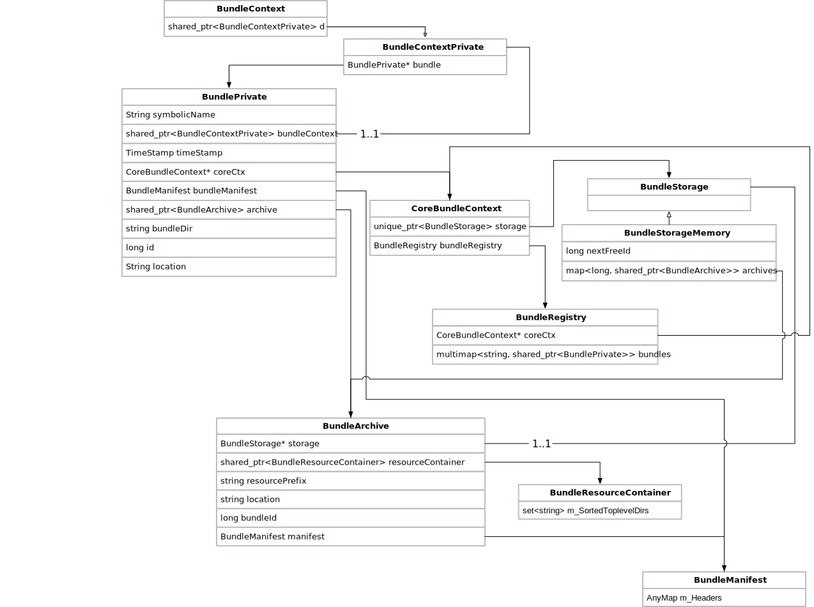
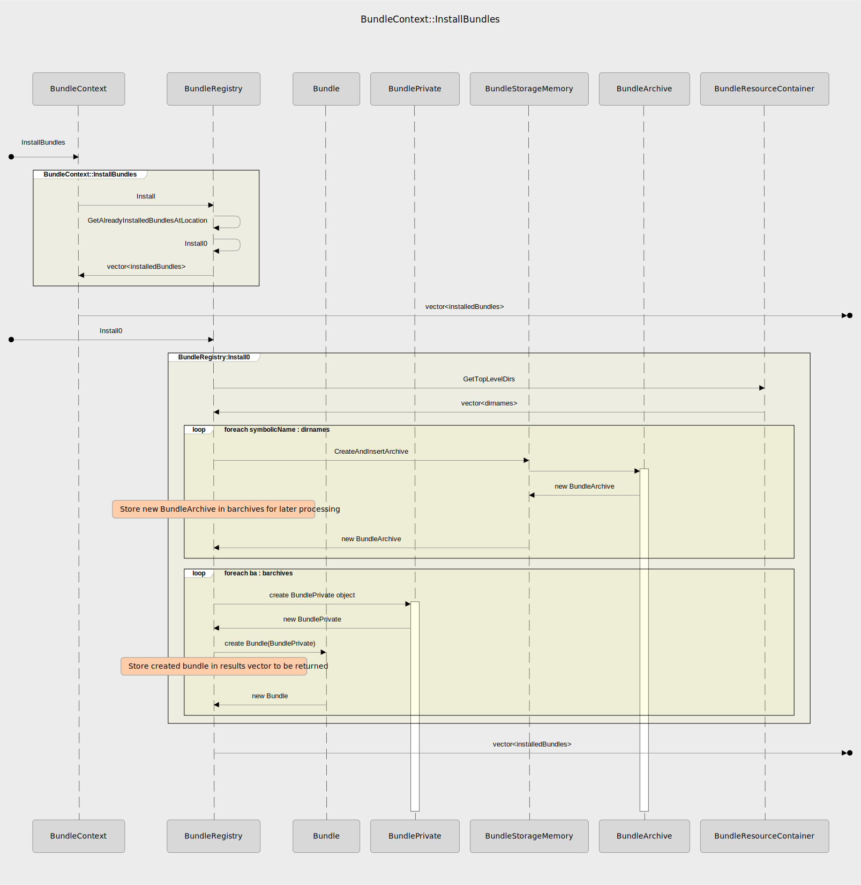

- Start Date: 2020-06-09
- RFC PR: (in a subsequent commit to the PR, fill me with the PR's URL)
- CppMicroServices Issue: (fill me with the URL of the CppMicroServices issue that necessisated this RFC, otherwise leave blank)

# Add BundleManifest Injection Capabilities 

## Summary

Provide a api to initialize the bundle registry with a bundle manifest during the BundleContext::InstallBundles operation by providing an optional argument containing a manifest.

## Motivation

Allows users of the system to install bundle without opening the archive containing the bundle. We will be able to use this mechanism to speed up initial install of very large numbers of bundles.

For example, imagine an application architected for extesibility using plugins, and imagine that the basic operations of the application are all implemented using that architecture. When the application starts, the list of plugins along with a description needs to be made available to the user (as a requirement of the application, not CppMicroServices).  In order to get the names and descriptions of the plugins, each bundle needs to be installed so that information from the manifest can be used. As the number of plugins grows, startup of the program takes longer and longer. After doing some analysis, the developer discovers that much of the application startup time is spent opening and reading the bundles for their manifests.

This proposal discusses an approach that could solve this problem with an API for injecting manifests into the BundleRegistry directly, without opening and reading the manifests from the bundles.

The inspiration for this API comes from the second  [installBundles API](https://docs.osgi.org/specification/osgi.core/7.0.0/framework.api.html#org.osgi.framework.BundleContext.installBundle-String-InputStream-) in the OSGi spec which provides for a stream from which to read the bundle.

## Detailed design

### Class Diagram

This is a partial class diagram showing the relationship between the pieces of the system used during the BundleContext::InstallBundles operation. Only those classes and fields that participate in that operation are shown.



### Sequence



### Classes

#### BundleContext

```c++
/**
 * Installs all bundles from the bundle library at the specified location.
 *
 * The following steps are required to install a bundle:
 * -# If a bundle containing the same install location is already installed, the Bundle object for that
 *    bundle is returned.
 * -# The bundle's associated resources are allocated. The associated resources minimally consist of a
 *    unique identifier and a persistent storage area if the platform has file system support. If this step
 *    fails, a std::runtime_error is thrown.
 * -# A bundle event of type <code>BundleEvent::BUNDLE_INSTALLED</code> is fired.
 * -# The Bundle object for the newly or previously installed bundle is returned.
 *
 * @remarks An install location is an absolute path to a shared library or executable file
 * which may contain several bundles, i. e. acts as a bundle library.
 *
 * @remarks If the bundleManifest is passed in, it is installed. When the bundle is Started, the
 * BundleManifest is NOT read from the file (as it has already been installed). In the event that
 * the injected bundle manifest does NOT match the manifest in the bundle's file, the behavior of
 * the system is undefined. That is, the content of the injected manifest and the manifest on disk
 * are expected to be the same and are not compared.
 * 
 * @param location The location of the bundle library to install.
 * @param bundleManifest the OPTIONAL manifest of the bundle at "location". If non-empty
 *        this will be used without opening the bundle at "location". Otherwise, the bundle will
 *        be opened and the manifest read from there.
 * @return The Bundle objects of the installed bundle library.
 * @throws std::runtime_error If the BundleContext is no longer valid, or if the installation failed.
 * @throws std::logic_error If the framework instance is no longer active
 * @throws std::invalid_argument If the location is not a valid UTF8 string
 */

vector<Bundle> BundleContext::InstallBundles(std::string location
                                             , std::vector<AnyMap> manifest);


```

* Modify old API to call new API with empty manifest map
* Wrapper around call to BundleRegistry::Install
* Refactor original API to call new API so we only have one implementation

#### BundleRegistry

```c++
/** Install the manifest for the bundle at location into the registry. 
* 
* The difference between this implementation and the existing implementation 
* that takes only the location argument is that in the original the manifest 
* is read from the bundle file rather than it being passed in as an argument.
* 
* @param location The absolute path to the location of the bundle whose manifest is to
*        be installed
* @manifest the manifest of the bundle at location
*/
vector<Bundle> BundleRegistry::Install(std::string location
                                       , std::vector<AnyMap> manifest);
```

* Update Install to accept a manifest to use for the installation instead of reading from bundle at location
* If manifest is and empty map, then proceed with install action as before. This accomplishes a lazy loading of the manifest from the file. The manifest is only read from the file in the event that it is empty when asked for.

#### BundleManifest

```c++
/** Initialize manifest with content of AnyMap
*
* Note: No validation is done on manifestHeaders. It is assumed that by
*       by this point, the headers are correct.
*
* @param manifestHeaders a map of the headers for a bundle manifest.
*/
explicit BundleManifest::BundleManifest(const AnyMap& manifestHeaders);

```

#### BundlePrivate

* Additional constructor that takes bundle manifest to be injected
* Modified to fetch bundle manifest from BundleArchive instead of parsing the resource
* Factor out manifest validation from constructor to allow for use from new constructor which takes a manifest to be injected as an argument

#### BundleStorage

The **BundleStorage** class hierarchy is used for implementing different strategies for tracking bundle **BundleArchives**. There are two subclasses, but only one of them provides an actual implementation. They are **BundleStorageMemory**, and **BundleStorageFile**. It also tracks which bundles are to be auto started.

```c++
  /**
   * Insert bundles from a container into persistent storagedata.
   *
   * This is a simpler version of the InstallBundles api that only deals with one bundle at a time.
   * 
   * @param resCont The container for the bundle data and resources.
   * @param topLevelEntries The top level entries in the container to be inserted as bundle archives.
   * @return A list of BundleArchive instances representing the installed bundles.
   */
  using ManifestT = cppmicroservices::AnyMap;
  virtual std::shared_ptr<BundleArchive> InsertArchive(const  std::shared_ptr<BundleResourceContainer>& resCont
                                                       , const std::string& topLevelEntry
                                                       , const ManifestT&) = 0;

```

* Combined BundleStorage::InsertBundleLib and BundleStorage::InsertArchives
  * InsertBundleLib was a wrapper around InsertArchives
    * It created a BundleResourceContainer for the location and called InsertArchives
    * Now the BundleResourceContainer is created if needed in BundleRegistry::GetAlreadyInstalldBundlesAtLocation and then passed in to BundleStorage::InsertArchive.

#### BundleArchive

* Refactor and remove Data class simplifying design.
* Add BundleManifest and constructor argument
  * Call BundleManifest::Parse from BundleArchive in the event that a manifest is not passed in at construction
* Add new **GetManifest()** method which does a lazy loadof the manifest from the archive if and only if we don't already have the manifest.

#### BundleResourceContainer

* Add **manifest** argument to constructor
  * If the **manifest** is not empty, use it to initialize the **m_SortedToplevelDirs**, and leave **m_IsContainerOpen** set to false
    * if **manifest** is empty, no manifest injection is happening, so open up the archive and read the manifest from there, set set **m_IsContainerOpen** to true.

#### BundleStorage(Memory)

**BundleStorage** is a base class from which 2 different implementations have been derived: BundleStorageMemory, and BundleStorageFile. Only BundleStorageMemory, has an actual implementation.

* Refactor
  * Remove **InsertArchives()** method and move loop to caller in **BundleRegistry::Install0**

#### Other Changes

* Various code cleanups (getting rid of "using std", exraneous cout output, etc.)

## Test Cases

- Install bundle manifest at a location, and then retrieve bundle and check manifest
- Install bundle manifest for a test bundle that exists. Then get the service, call a method through the service interface and made sure that it was successfully started.
- Install bundle manifest for multiple bundles that exist on disk and then start each one and verify that they have been properly instantiated.
- a bundle installed more than once always returns the originally installed bundle to the caller and does not create multiple entries in the bundle registry for the same bundle.
- Test for malformed manifest data.
  - I need to add manifest validation for required pieces of metadata for a bundle to work properly... we think that's only the bundle.symbolic_name.

## How we teach this

The optional bundleManifest argument to BundleContext::InstallBundles(location, bundleManifest) is a map that is formatted as follows:

- **Key**: Symbolic Name of the bundle.
- **Value**: The manifest for the bundled named in the **Key**.
  - The value should be an exact representation of the entire manifest for the named bundle and should follow all the same rules
    - bundle.symbolic_name must be defined (and also must match the **Key** from above)
    - If bundle.version is specified, it must be in the correct format: "major.minor.patch"

The following JSON snippet represents an example of the content of the AnyMap passed in the optional second parameter to BundleContext::InstallBundles(location, bundleManifest)

```json
{
    "SymbolicNameBundle1" : {
        "bundle.activator" : false,
        "bundle.version" : "1.0.0",
        "bundle.symbolic_name" : "SymbolicNameBundle1",
        "bundle.vendor" : "cppms co.",
        ... any other data in the manifest
    }
}

```

There may be more than one bundle manifest in the case of a statically linked bundle. In this case, there needs to be an entry for each bundle present:

```json
{
    "SymbolicNameBundle1" : {
        "bundle.activator" : false,
        "bundle.version" : "1.0.0",
        "bundle.symbolic_name" : "SymbolicNameBundle1",
        "bundle.vendor" : "cppms co.",
        ... any other data in the manifest
    },
    "SymbolicNameBundle2" : {
        "bundle.activator" : false,
        "bundle.version" : "1.0.0",
        "bundle.symbolic_name" : "SymbolicNameBundle2",
        "bundle.vendor" : "cppms co.",
        ... any other data in the manifest
    }
}
```


## Drawbacks

There are some things to be aware of:

* If a **bundleManifest** is passed in as the second argument to **BundleContext::InstallBundles(location, bundleManifest)** which does not match the bundleManifest actually contained in the bundle, the behavior is undefined. There is no error checking to make sure the manifests match. Doing so would be very time consuming and the whole point of this change is to provide a mechanism to reduce the overhead of installing, and eventually starting a bundle.

## Alternatives

> What other designs have been considered? What is the impact of not doing this?

> This section could also include prior art, that is, how other frameworks in the same domain have solved this problem.

## Unresolved questions

> Optional, but suggested for first drafts. What parts of the design are still
> TBD?