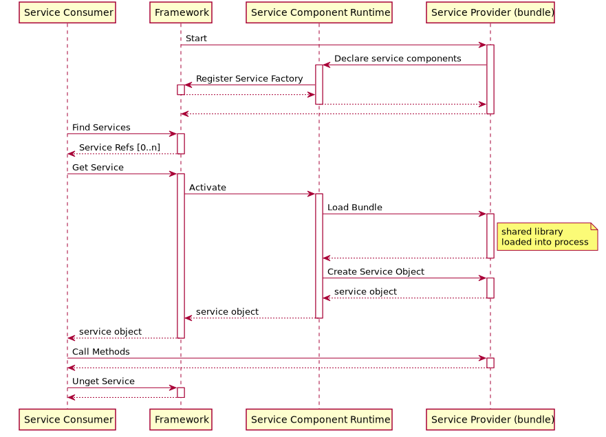

- Start Date: 2021-01-04
- RFC PR: https://github.com/CppMicroServices/rfcs/pull/17
- CppMicroServices Issue: n/a

# CppMicroServices Security: Bundle Validation

## Summary

> One paragraph explanation of the feature.

This feature attempts to adapt parts of the [OSGi Core Release 7 Security Layer specification](https://docs.osgi.org/specification/osgi.core/7.0.0/framework.security.html).

The purpose of this feature is provide CppMicroServices Framework users with a mechanism by which to validate the authenticity of a bundle's shared library before it is loaded into a process.

The scope of this feature is narrow and focuses on defining the parts of the OSGi security layer specification having to do with certificates and code signing. Everything having to do with Permissions and the permissions model, which is tightly coupled to the Java language and JVM, is out of scope.

## Motivation

> Why are we doing this? What use cases does it support? What is the expected
outcome?

There is a need to ensure that a bundle's shared library has not been tampered with before it is loaded into a process. Given the dynamic, runtime nature of bundles it can be trivial for a third party to replace a bundle's shared library on disk with a modified versions that runs unwanted, malicious code. Vendors integrating and shipping CppMicroServices with their software should be able to validate and enforce the authenticity of their CppMicroServices bundles. 

## Use Cases

### Scriptable and automated replacement of CppMicroServices bundles

Attackers can script the replacement of bundles on disk with some investigation into when bundles are installed and started by a program. Without a check for the authneticity of the bundle before it's code is loaded into the process, runtime bundle replacement is a relatively easy attack vector.

### Software developers who explicitly don't want to do bundle validation

There exists cases where bundle validation for certain bundles is undesirable such as:
1. performance, there is a runtime cost to validating the authenticity of a bundle.
2. the bundle is meant to be modified by attackers and to gather information from attackers (e.g. [honeypots](https://en.wikipedia.org/wiki/Honeypot_(computing)))


## Out of Scope

- Validating data-only bundles is out of scope for the initial version of bundle validation. This will be addressed in the next version of this feature. Securing the data within a data-only bundle is also important as it can be used as inputs into CppMicroServices services.
- Infrastructure to code sign bundles. This must be provided by the CppMicroServices Framework user.
- An implementation of the OSGi Core Release 7 Security Layer Permissions model is out of scope. This part of the OSGi specification is tightly coupled to the Java language and JVM and requires more careful consideration on how to adapt and implement it for C++.

## Detailed design

> This is the bulk of the RFC.

> Explain the design in enough detail for somebody
familiar with the framework to understand, and for somebody familiar with the
implementation to implement. This should get into specifics and corner-cases,
and include examples of how the feature is used. Any new terminology should be
defined here.

### Summary

This is a high-level summary of the design. These points will be expanded upon in the rest of the functional design.

- Create a new Framework configuration property to allow a single user-defined function to be injected into the core Framework at creation which will be called by the Framework at certain points in the bundle lifecycle to validate bundles.
- This user-defined function is responsible for excluding bundles from being validated.
- Extenders, like Declarative Services, can validate bundles by querying the CppMicroServices Framework properties for the user-defined function and calling it.
- There is one user-defined bundle validation callback function per instance of the `cppmicroservices::Framework` object.
- The existence of a user-defined bundle validation callback function implicitly enables bundle validation for all bundle's shared libraries loaded by that `cppmicroservices::Framework` object.


### Bundle Validation Callback

The user-defined bundle validation callback function must have the following function signature:
```c++
/**
 * Return true if bundle is a valid bundle, false otherwise.
 * Any exceptions thrown from this function will be caught and logged
 * by the CppMicroServices framework.
 *
 * Returning true indicates to the CppMicroServices that this bundle can be
 * loaded into the process. Any other value, including an exception, will
 * result in the library not being loaded into the process.
 */
bool(const cppmicroservices::Bundle& bundle)
```

This callback function will be called by the CppMicroServices Framework, Declarative Services, and any other future extender bundle which loads a bundle's shared library.

**Exception Handling:** If this function throws, it will be caught, logged as a `cppmicroservices::FrameworkEvent` by CppMicroServices or Declarative Services and the shared library will not be loaded into the process. The exception thrown from this function will be wrapped in a `cppmicroservices::SecurityException` and propagated to the caller.

**Object lifetime:** This function is scoped to the lifetime of the `cppmicroservices::Framework` object.

**Concurrency notes:**

- The CppMicroServices Framework will not hold any internal locks on the thread calling this function.
- This function can be called concurrently and the function implementation is responsible for its own thread safety.
- There is no guarantee as to the thread on which this function will be called. CppMicroServices and other extender bundles may or may not call this function on a different thread.
- It is recommended **not** to call CppMicroServices Framework APIs other than read only `cppmicroservices::Bundle` methods from the implementation of this function. Especially those which trigger bundle operations (e.g. GetServiceReference, GetService, InstallBundles, Start, and Stop).

### Framework Configuration Property

A new Framework configuration property will be established which will contain a Callable object as its value.

The Framework configuration property key name will be **org.cppmicroservices.framework.bundle.validation.function** and its value will be a `cppmicroservices::Any` object which can be `any_cast` to a `std::function<bool(const cppmicroservices::Bundle&)>`

```c++
cppmicroservices::FrameworkConfiguration configuration {
                                 { cppmicroservices::Constants::FRAMEWORK_BUNDLE_VALIDATION_FUNCTION, 
                                   [](const cppmicroservices::Bundle&) -> bool { /* bundle validation implementation */ } }
                             };
                              
try {
      framework = std::make_shared<cppmicroservices::Framework>(cppmicroservices::FrameworkFactory().NewFramework(std::move(configuration)));
} catch(...) { }
```

### Calling the bundle validation callback

The CppMicroServices Framework provides read-only access to Framework configuration properties through the `BundleContext::GetProperty` method. Using this method any code which has access to the CppMicroServices Framework object can execute the bundle validation callback function.

```c++
// assume a cppmicroservices::Framework object named 'framework'...
 
// The validation function can be accessed through the BundleContext::GetProperty() API.
// BundleContext::GetProperty() returns read-only access to the Framework configuration properties
Any validationFunc = framework->GetBundleContext()->GetProperty(cppmicroservices::Constants::FRAMEWORK_BUNDLE_VALIDATION_FUNCTION);
 
// call the function
using validationFuncType = std::function<bool(const cppmicroservices::Bundle&)>;
bool isBundleValid = any_cast<validationFuncType>(validationFunc)(bundle);
```

### Bundle Validation Errors

Bundle validation introduces a new failure mode for CppMicroServices Framework users which they will not expect.

Since bundle validation will happen at bundle start in the bundle lifecycle, a user does not know whether a bundle passed validation at the time of bundle install. Bundle validation can cause the following operations to fail:

- Bundle Start
- Getting a service (when combined with Declarative Services)

The problem is similar to that of [CppMicroServices framework shared library error handling](https://github.com/CppMicroServices/rfcs/blob/master/text/0004-ds-dlopen-error-handling.md); the user cannot distinguish the reason for failure based on the return value of the CppMicroServices API. If a user calls BundleContext::GetService and it returns nullptr; is that because the service is not registered? because the shared library could not be loaded? because a dependent service couldn't be found? The return value from these APIs do not provide sufficient information.

To address this a similar solution to [shared library error handling](https://github.com/CppMicroServices/rfcs/blob/master/text/0004-ds-dlopen-error-handling.md#detailed-design) will be used. This involves:

- Creating a new cppmicroservices::SecurityException class in CppMicroServices. This exception will be thrown when the bundle validation callback function fails.
- CppMicroServices and Declarative Services will catch and log any exceptions thrown from the bundle validation callback function and throw a cppmicroservices::SecurityException containing the original exception's message.

This class is designed to be derived from in the same way that java.security [GeneralSecurityException](https://docs.oracle.com/en/java/javase/14/docs/api/java.base/java/security/GeneralSecurityException.html) and std::exception is derived from to provide more specific contexts.

```c++
namespace cppmicroservices {
  class SecurityException : public std::runtime_error
  {
  public:
    explicit SecurityException(std::string what, cppmicroservices::Bundle origin);
    ~SecurityException() override;
    Bundle GetBundle() const;
 
  private:
    Bundle origin; ///< The bundle from which the exception originated.
  }
}
```


### CppMicroServices Framework and Compendium API Changes

Bundle validation will happen during bundle start, specifically before the bundle's shared library is loaded (via dlopen/LoadLibrary). Bundle validation will typically be invisible to CppMicroServices bundle authors and consumers, only becoming relevant when bundle validation errors occur.

All public CppMicroServices APIs are unchanged. The following APIs are affected and will include doxygen updates to declare they can throw a cppmicroservices::SecurityException.

| Header file     | APIs                                   |
|-----------------|----------------------------------------|
| BundleContext.h | ```void Start(uint32_t options);``` <br><br> ```void Start();``` <br><br> ```std::shared_ptr<void> GetService(const ServiceReferenceBase& reference);``` <br><br> ```InterfaceMapConstPtr GetService(const ServiceReferenceU& reference);``` <br><br> ```template<class S> std::shared_ptr<S> GetService(const ServiceReference<S>& reference)``` <br><br> ```template<class S> ServiceObjects<S> GetServiceObjects(const ServiceReference<S>& reference)``` |
| cppmicroservices\cm\Configuration.hpp  | ```virtual std::shared_future<void> Update(AnyMap properties)l``` <br><br> ```virtual std::pair<bool, std::shared_future<void>> UpdateIfDifferent(AnyMap properties);```
| cppmicroservices\servicecomponent\runtime\ServiceComponentRuntime.hpp | ```virtual std::shared_future<void> EnableComponent(const dto::ComponentDescriptionDTO& description);``` |

### Opting out of bundle validation

The capability to exclude bundles from bundle validation is required and this exclusion mechanism must not be easily exploitable as to allow a third party to circumvent bundle validation entirely.

Given these requirements any dynamic run-time solution, such as using bundles or other plugin based designs to store the exclusion data, is fundamentally flawed as it allows run-time replacement of the bundles/plugins containing the exclusion data.

The proposed solution for opting out of bundle validation is to leave it to the implementation of the bundle validation callback function provided by the CppMicroServices Framework user. Given the `cppmicroservices::Bundle` object passed to the callback function, a callback function implementation should have sufficient information to determine whether that bundle should be validated or not.

## Architecture

### Summary

This design uses the [Framework configuration properties mechanism](http://docs.cppmicroservices.org/en/stable/framework/doc/api/util/FrameworkFactory.html) to inject a user-defined bundle validation callback function into a Framework object upon creation. The bundle validation callback function is called internally by the CppMicroServices framework before any bundle's shared library is loaded. The user-defined bundle validation callback function is available to any CppMicroServices API user, including extenders such as Declarative Services.

One new class, ```cppmicroservices::SecurityException```, will be added to provide better runtime diagnostics when bundle validation fails.

### Architecturally Significant Design Case(s)

#### Lazily Loading Declarative Services Bundles

The following diagram is a simplified version of what happens when a service consumer gets a service object which is managed by Declarative Services.

This diagram shows when the bundle's shared library is loaded into the process by Declarative Services (i.e. Service Component Runtime), which is the point at which the bundle validation function will be called.



#### Bundle Start

The following diagram is a simplified version of what happens when a CppMicroServices Framework client starts a non Declarative Services bundle.

Bundle validation function will be called before the bundle's shared library is loaded into the process by CppMicroServices.


## How we teach this

> What names and terminology work best for these concepts and why? How is this
idea best presented? As a continuation of existing CppMicroServices patterns, or as a
wholly new one?

The concept of bundle validation is best represented and discussed through the context of the OSGi Security Layer. The concepts of certificates and code signing are explained in this specification and those core concepts are the same for this proposal. The main differences are in how the bundles are code signed and how bundles are validated.

> Would the acceptance of this proposal mean the CppMicroServices guides must be
re-organized or altered? Does it change how CppMicroServices is taught to new users
at any level?

This proposal would require additional guides and documentation to be created to help users integrate and use bundle validation. This is an optional security feature for use by CppMicroServices Framework users and is disabled by default. This feature does require knowledge of code signing binary files, how to do it per OS platform and the methods by which code signed binaries can be authenticated. This information is readily available through other documentation and resources online.

> How should this feature be introduced and taught to existing CppMicroServices
users?

This feature should be introduced through the online cppmicroservices documentation.

## Drawbacks

> Why should we *not* do this? Please consider the impact on teaching CppMicroServices,
on the integration of this feature with other existing and planned features,
on the impact of the API churn on existing apps, etc.

- This feature does introduce new failure modes when calling existing CppMicroServices and compendium APIs. New exceptions can be thrown from existing and commonly used APIs.

> There are tradeoffs to choosing any path, please attempt to identify them here.

- Having a single bundle validation function set by the Framework integrator could be limiting for integrators who use CppMicroServices bundles from third party vendors. How does one write a bundle validaiton function to handle bundles code signed (or not) from third party vendors?
- Linux does not have standard tooling distributed with the OS to code sign binaries. Users are on their own with how to code sign and validate bundles on Linux.


## Alternatives

> What other designs have been considered? What is the impact of not doing this?

### Statically linked Security layer bundle. 

- Implement a security layer service as a [statically linked bundle](http://docs.cppmicroservices.org/en/stable/framework/doc/static_bundles.html) built into the core cppms bundle at build-time.
- A statically linked bundle stops run-time replacement of the security layer since there is no shared library to replace, the entire CppMicroServices framework library would need to be replaced.
- Use the same technique as the preferred design to stop the CppMicroServices framework from being replaced (see section "Guarding against replacement of the CppMicroServices Framework")
use a set of Framework configuration properties to define what constitutes a "valid bundle".
  - This set of Framework configuration properties will define how the the security layer is configured and its behavior.
  - This set of Framework configuration properties will allow definition of a list of valid code signers identified by their issuer name, subject and public keys.
  - Each list of valid code signers can have other attributes such as whether to fail bundle validation if the certificate has expired
  - The Framework configuration properties could also contain a keystore to either replace or supplement the Operating Systems root CA store
- The statically linked bundle linked to the CppMicroServices framework can register its services before any other bundle can register the same service, meaning it can register its service first and with the highest priority.
- The CppMicroServices framework owns the security layer service's ServiceRegistration object so the service can be kept alive by the CppMicroServices framework holding onto the security layer's service object.
- Extenders, like Declarative Services, access the security layer like any other service. It is the responsibility of the extenders to enforce security checks within their implementations as appropriate.
- The timing of the bundle validation check is the same as the preferred design; right before dlopen/LoadLibrary is called.


The impact of doing nothing is that CppMicroServices bundles can be easily replaced by attackers.

> This section could also include prior art, that is, how other frameworks in the same domain have solved this problem.

## Unresolved questions

> Optional, but suggested for first drafts. What parts of the design are still
TBD?
