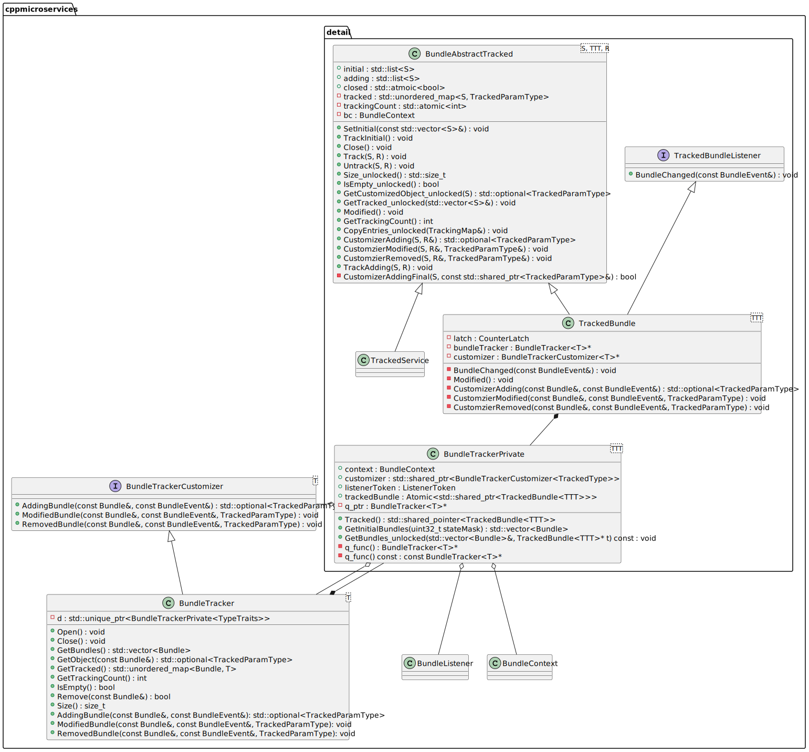
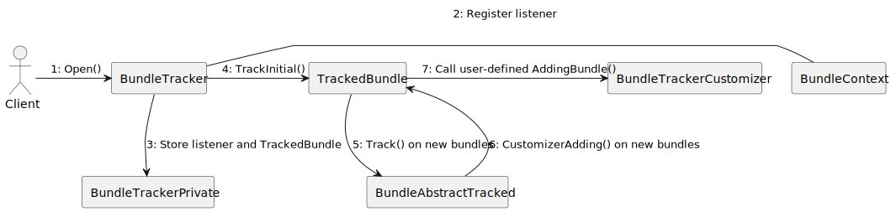
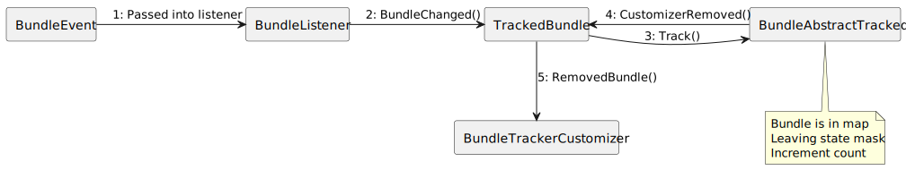
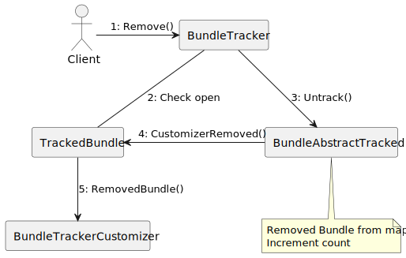
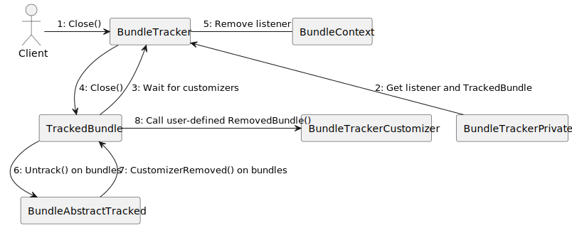

- Start Date: 2022-05-25
- RFC PR: [BundleTracker RFC#18](https://github.com/CppMicroServices/rfcs/pull/18)
- CppMicroServices Issue: [CppMicroServices/CppMicroServices#100](https://github.com/CppMicroServices/CppMicroServices/issues/100)

# Integration of BundleTracker into Core Framework

## Summary
****
This document describes the design and integration of the `BundleTracker` into the CppMicroServices core framework. The `BundleTracker` functionality is described in the [OSGI BundleTracker Specification](http://docs.osgi.org/specification/osgi.core/7.0.0/util.tracker.html#d0e52020), which is mapped to an API definition in C++ described in this document. This document discusses the need for adding `BundleTracker` to the core framework. Namely, there is existing compendium code that uses workarounds for lack of a BundleTracker in the core framework (e.g. bundle extension creation/destruction in DeclarativeServices), that would be made simpler and more robust with a proper `BundleTracker` implementation. Additionally, a chosen design and alternative implementations for `BundleTracker` are discussed.

## Motivation
****

It is useful to be able to react to state changes in bundles. The core framework offers a `BundleListener` to do this, but it is limited in its functionality.

The main issue with the `BundleListener` is that it only gives the user information on the bundle state changes _after_ the listener is registered, not the full history of bundle states. Therefore, the user will not find out about any bundles that have been in a certain state since before the `BundleListener` was registered. The `BundleTracker`, on the other hand, provides the full history of states for bundles (initial, transitory, and current).

To discover this prior information without a `BundleTracker`, a user might loop over the previously installed bundles before starting the `BundleListener`. In a multithreaded context, this creates synchronization problems that are non-trivial to solve. Since bundles can be installed or uninstalled at any time, it is possible for a bundle added by the user's loop to be uninstalled before the listener is registered. That state change gets missed using this workaround.

Currently, Declarative Services (DS) works around the lack of a `BundleTracker` using a method similar to the one described above. In the `SCRActivator`, DS registers a `BundleListener`with a callback to respond to changes in bundle states. Then, it loops through the active bundles in the `BundleContext` to manually trigger the same callback on them. This workaround will find bundles started before the listener is registered, but creates other problems. Namely, if a bundle is started in between these two operations, it could cause the callback to be triggered twice on that bundle.

__Note__: The issues with the `BundleListener` necessitating a `BundleTracker` are mirrored by the `ServiceListener` and the `ServiceTracker`, which has been implemented in the CppMicroServices core framework.

## Requirements Analysis
****
### User Roles and Goals

<table>
<thead>
<tr class="header">
<th><p>ID.</p></th>
<th><p>Priority</p></th>
<th><p>User Roles</p></th>
<th><p>User Goals (What and Why)</p></th>
</tr>
</thead>
<tbody>
<tr class="odd">
<td><p>1</p></td>
<td><p>High</p></td>
<td><p>Casual User of Declarative Services</p></td>
<td><p><em>What:</em> Trust that Declarative Services will always detect bundles started before starting DS.<br />
<em>Why:</em></p>
<ol>
<li>Preserve the abstraction that Declarative Services provides to the casual CppMicroservices user</li>
<li>Improve software maintainability and simplify product deployment</li>
</ol></td>
</tr>
<tr class="even">
<td><p>2</p></td>
<td><p>High</p></td>
<td><p>Advanced Service Author</p></td>
<td><p><em>What:</em> Create services that leverage resources stored in bundles.<br />
<em>Why:</em></p>
<ol>
<li>Separate resources from resource users</li>
<li>Handle resource absence gracefully</li>
<li>Create scalable, extensible and reactive systems</li>
</ol></td>
</tr>
</tbody>
</table>

### Use Cases

#### UC1: Casual User of Declarative Services

Lucas is a casual user who uses DS to handle the loading and unloading of DS service components for his bundle. Lucas trusts that DS will always perform this operation correctly. However, since there is no `BundleTracker` implemented in the core framework, Declarative Services currently could miss bundles that change state before the startup of DS. This can keep services from registering that are ready, breaking the behavior Lucas excepts. (PP1).

#### UC2: Advanced Service Author

Diana is a service author who wants to create a service that provides resources to a user, where these resources are stored in bundles. In this application, it is not guaranteed that the provider service will be registered before the resource bundles are started. If a `BundleListener` is used to track the addition and removal of resources, Diana's application will not track bundles started before the service (PP2). Additionally, attempted resolutions to this issue in user code, like looping through the installed bundles already started, could create race conditions or performance issues at scale (PP3). As an alternative, Diana would like to be able to add her own tracked objects and callbacks through a core framework construct (PP4).

### Pain Point Summary

PP1: Declarative Services currently has a workaround for the lack of a `BundleTracker` in its bundle activator code, which can fail if bundles are installed or change states before the DS `BundleListener` is registered.

PP2: Listeners on their own are insufficient in creating an up-to-date record of bundle states for user code, since bundle states that have not changed since the addition of the listener will not be tracked.

PP3: It is easy for a user to incorrectly implement a tracking workaround that works sometimes, but fails under certain race conditions or fails to be performant on a large scale.

PP4: Currently, there is not a method of tracking custom objects alongside bundles in the core framework like there is in the OSGi specification.

### Requirements

<table>
<thead>
<tr class="header">
<th><p>ID</p></th>
<th><p>Statement</p></th>
<th><p>Pain Point ID / Rationale</p></th>
<th><p>Priority</p></th>
</tr>
</thead>
<tbody>
<tr class="odd">
<td>R1_Tracking</td>
<td>The solution must be able to start after bundles are started, while constructing a record of current and previous bundle states and avoiding duplicate callback invocations or missed callbacks.</td>
<td>PP1, PP2</td>
<td>Must have</td>
</tr>
<tr class="even">
<td>R2_Thread_Safety</td>
<td>The solution must be internally thread-safe.</td>
<td>PP3</td>
<td>Must have</td>
</tr>
<tr class="odd">
<td>R3_Standardization</td>
<td>The solution should conform to the OSGi specification for BundleTracker as it makes sense in C++</td>
<td><a href="http://docs.osgi.org/specification/osgi.core/7.0.0/util.tracker.html#d0e52020">OSGi Spec</a>, PP4</td>
<td>Must have</td>
</tr>
<tr class="even">
<td>R4_Quality</td>
<td>The solution should be robust and bug-free.</td>
<td>PP1</td>
<td>Must have</td>
</tr>
<tr class="odd">
<td>R5_Efficiency</td>
<td>The solution should not negatively impact the performance of CppMicroServices and its downstream clients.</td>
<td></td>
<td>Must have</td>
</tr>
</tbody>
</table>

## Functional Design
****
### Functional Design Summary

The API for the `BundleTracker` closely mirrors that of the OSGi specification. Smart pointers are used for the `BundleTracker` API to simplify lifetime and ownership of certain objects. Also, The `BundleTracker` is templated to allow for custom object types to be tracked, containing extra data or functionality.

### Class Definitions

The class definition for `BundleTracker` is as follows:

```cpp

namespace cppmicroservices {

/**
 * The BundleTracker class allows for keeping an accurate record of bundles and handling
 * state changes, including bundles started before the tracker is opened.
 *
 * <p>
 * A BundleTracker is constructed with a state mask and a BundleTrackerCustomizer object.
 * The BundleTracker can select certain bundles to be tracked and trigger custom callbacks
 * based on the provided BundleTrackerCustomizer or a BundleTracker subclass. Additionally,
 * the template parameter allows for the use of custom tracked objects. Once the BundleTracker
 * is opened, it will begin tracking all bundles that fall within the state mask.
 *
 * <p>
 * Use the GetBundles object to get the tracked Bundle objects, and GetObject to get the customized
 * object.
 *
 * <p>
 * The BundleTracker class is thread-safe. It does not call BundleTrackerCustomizer methods while
 * holding any locks. Customizer implementations must be thread-safe.
 *
 * @tparam T The type of tracked object.
 * @remarks This class is thread safe.
 */
template <class T = Bundle>
class BundleTracker : protected BundleTrackerCustomizer<T>
{
public:

    /**
     * Create a BundleTracker that tracks bundles through states covered by the state mask.
     * 
     * @param context The BundleContext from which tracking occurs.
     * @param stateMask The bit mask which defines the bundle states to be tracked.
     * @param customizer The customizer to call when bundles are added, modified, or removed.
     *                   If the customizer is nullptr, then the callbacks in this BundleTracker will 
     *                   be used instead (default or can be overridden).
     *
     * @see Bundle::State
     */
    BundleTracker(const BundleContext& context,
                uint32_t stateMask,
                std::shared_ptr<BundleTrackerCustomizer<T>> customizer = nullptr) {}

    /**
     * Automatically close the BundleTracker
     */
    ~BundleTracker() override;

    /**
     * Close this BundleTracker.
     *
     * Removes all tracked bundles from this BundleTracker, calling RemovedBundle on all of the
     * currently tracked bundles. Also resets the tracking count.
     */
    void Close();

    /**
     * Returns an array of all the tracked bundles.
     *
     * @return A vector of Bundles (could be empty).
     */ 
    std::vector<Bundle> GetBundles();

    /**
     * Returns the custom object for the given Bundle if the given Bundle is tracked. Otherwise null.
     *
     * @param bundle The Bundle paired with the object
     * @return The custom object paired with the given Bundle or null if the Bundle is not being tracked.
     */
    std::optional<T> GetObject(const Bundle& bundle);

    /**
     * Returns an unordered map from all of the currently tracked Bundles to their custom objects.
     *
     * @return An unordered map from all of the Bundles currently tracked by this
     * BundleTracker to their custom objects.
     */
    std::unordered_map<Bundle, T> GetTracked();

    /**
     * Returns the tracking count for this BundleTracker.
     *
     * The tracking count is set to 0 when the BundleTracker is opened.
     * The tracking count increases by 1 anytime a Bundle is added,
     * modified, or removed from the BundleTracker.
     * Tracking counts from different times can be compared 
     * to determine whether any bundles have changed.
     * If the BundleTracker is closed, return -1.
     *
     * @return The current tracking count.
     */
    int32_t GetTrackingCount();

    /**
     * Returns true if and only if this BundleTracker is tracking no bundles.
     *
     * @return true if and only if this BundleTracker is empty.
     */
    bool IsEmpty();

    /**
     * Open this BundleTracker to begin tracking bundles.
     *
     * Bundles that match the state mask will be tracked by this BundleTracker.
     *
     * @throws std::logic_error If the BundleContext used in the creation of this
     * BundleTracker is no longer valid.
     */
    void Open();

    /**
     * Remove a bundle from this BundleTracker.
     *
     * @param bundle the Bundle to be removed
     */
    void Remove(const Bundle&);

    /**
     * Return the number of bundles being tracked by this BundleTracker.
     *
     * @return The number of tracked bundles.
     */
    size_t Size();

    // Default BundleTrackerCustomizer Methods

    /**
     * Called when a Bundle is being added to the BundleTracker 
     * and the customizer constructor argument was nullptr.
     * 
     * When the BundleTracker detects a Bundle that should be added to the tracker 
     * based on the search parameters (state mask, context, etc.),
     * this method is called. This method should return the object to be tracked 
     * for the specified Bundle if the BundleTracker is being extended.
     * Otherwise, return the Bundle itself. If the return is nullptr, the Bundle is not tracked.
     *
     * @param bundle The Bundle being added to the BundleTracker.
     * @param event the BundleEvent which was caught by the BundleTracker.
     *
     * @return The object to be tracked for the specified Bundle object or std::nullopt to avoid tracking the Bundle.
     *
     * @see BundleTrackerCustomizer:AddingBundle(const Bundle&, const BundleEvent&)
     */
    std::optional<T> AddingBundle(const Bundle& bundle, const BundleEvent& event);

    /**
     * Called when a Bundle is modified that is being tracked by this BundleTracker
     * and the BundleTrackerCustomizer constructor argument was nullptr.
     *
     * When a tracked bundle changes states, this method is called.
     *
     * @param bundle The tracked Bundle whose state has changed.
     * @param event The BundleEvent which was caught by the BundleTracker. Can be null.
     * @param object The tracked object corresponding to the tracked Bundle (returned from AddingBundle).
     *
     * @see BundleTrackerCustomizer:ModifiedBundle(Bundle, BundleEvent, std::shared_ptr<T>)
     */
    void ModifiedBundle(const Bundle& bundle, const BundleEvent& event, T object);

    /**
     * Called when a Bundle is being removed from this BundleTracker
     * and the BundleTrackerCustomizer constructor argument was nullptr.
     *
     * @param bundle The tracked Bundle that is being removed.
     * @param event The BundleEvent which was caught by the BundleTracker. Can be null.
     * @param object The tracked object corresponding to the tracked Bundle (returned from AddingBundle).
     *
     * @see BundleTrackerCustomizer:RemovedBundle(const Bundle&, const BundleEvent&, T)
     */
    void RemovedBundle(const Bundle& bundle, const BundleEvent& event, T object);

    // Static methods

    /**
     * Called to create a state mask using bitwise OR
     *
     * @param states The bundle states for the mask.
     *
     * @return A state mask for use in the BundleTracker constructor.
     */
    static BundleTracker::StateType CreateStateMask(Bundle::State states...);

private:
    std::unique_ptr<BundleTrackerPrivate<TypeTraits>> d;

};

} // namespace cppmicroservices

```

The interface definition for `BundleTrackerCustomizer` is as follows:

```cpp
namespace cppmicroservices {

/**
 * The BundleTrackerCustomizer interface allows for user callbacks to be included in a
 * BundleTracker. These callback methods customize the objects that are tracked.
 * A BundleTrackerCustomizer is called when a Bundle is being added to a BundleTracker,
 * and it can then return an object for that tracked bundle. A BundleTrackerCustomizer,
 * is also called when a tracked bundle is modified or has been removed from a BundleTracker.
 *
 * <p>
 * BundleEvents are received synchronously by the BundleTracker, so it is recommended that
 * implementations of the BundleTrackerCustomizer do not alter bundle states while being synchronized
 * on any object.
 *
 * @tparam T The type of the tracked object. Defaults to Bundle.
 * @remarks This class is thread safe. All implementations should also be thread safe.
 */
template <class T = Bundle>
class BundleTrackerCustomizer
{
public:

    /**
     * Called when a Bundle is being added to the BundleTracker.
     * 
     * When the BundleTracker detects a Bundle that should be added to the tracker 
     * based on the search parameters (state mask, context, etc.),
     * this method is called. This method should return the object to be tracked 
     * for the specified Bundle if the BundleTracker is being extended.
     * Otherwise, return the Bundle itself. If the return is nullptr, the Bundle is not tracked.
     *
     * @param bundle The Bundle being added to the BundleTracker.
     * @param event the BundleEvent which was caught by the BundleTracker. Can be null.
     *
     * @return The object to be tracked for the specified Bundle object or std::nullopt to avoid tracking the Bundle.
     *
     * @see BundleTrackerCustomizer:AddingBundle(Bundle, BundleEvent)
     */
    virtual std::optional<T> AddingBundle(const Bundle& bundle, const BundleEvent& event) = 0;

    /**
     * Called when a Bundle is modified that is being tracked by this BundleTracker.
     *
     * When a tracked bundle changes states, this method is called.
     *
     * @param bundle The tracked Bundle whose state has changed.
     * @param event The BundleEvent which was caught by the BundleTracker. Can be null.
     * @param object The tracked object corresponding to the tracked Bundle (returned from AddingBundle).
     *
     * @see BundleTrackerCustomizer:ModifiedBundle(Bundle, BundleEvent, std::shared_ptr<T>)
     */
    virtual void ModifiedBundle(const Bundle& bundle, const BundleEvent& event, T object) = 0;

    /**
     * Called when a Bundle is being removed from this BundleTracker
     *
     * @param bundle The tracked Bundle that is being removed.
     * @param event The BundleEvent which was caught by the BundleTracker. Can be null.
     * @param object The tracked object corresponding to the tracked Bundle (returned from AddingBundle).
     *
     * @see BundleTrackerCustomizer:RemovedBundle(Bundle, BundleEvent, std::shared_ptr<T>)
     */
    virtual void RemovedBundle(const Bundle& bundle, const BundleEvent& event, T object) = 0;

    virtual ~BundleTrackerCustomizer() {}
};
}
```

### BundleTracker Usage

#### Creating a BundleTracker

The `BundleTracker` has a template argument `T` in this API that corresponds to the wrapper object type. This defaults to `Bundle` if no wrapper object is used. The `BundleTracker` constructor takes three arguments:

- The `BundleContext` from which the tracker shall be created.
- An unsigned 32-bit integer as a mask of states, where all of the active bits correspond to Bundle states that will be tracked. The `CreateStateMask` method is defined to simplify the creation of these masks
- A shared pointer to a `BundleTrackerCustomizer` object. If `nullptr` is supplied to the constructor, the `BundleTracker` will use its internal `BundleTrackerCustomizer` methods.

Once the `BundleTracker` is constructed, `Open()` is called to begin the tracking of bundles. When tracking is no longer necessary, `Close()` is called to stop tracking bundles. Additionally, `Close()` will be called automatically on an open `BundleTracker` if it goes out of scope.

#### Using a BundleTracker

Once a `BundleTracker` is opened, there are API methods to gain information and monitor bundles:

- `GetBundles()` returns the `Bundle` objects currently being tracked.
- `GetObject(Bundle)` returns the custom object paired to a `Bundle`. In the default case (`T` = `Bundle`), this returns the same `Bundle`.
- `GetTracked()` returns all of the bundles and custom objects as an unordered map. In the default case (`T` = `Bundle`), this maps from `Bundle`s` to themselves.
- `IsEmpty()` tells the client whether bundles are being tracked.
- `Size()` returns the number of currently tracked bundles.
- `GetTrackingCount()` returns a tracking number that ticks up every time the `BundleTracker` changes, allowing for comparisons over time.

#### Customizing a BundleTracker

To implement the `BundleTrackerCustomizer` methods, there are two options that have the same effect:

- Subclassing `BundleTrackerCustomizer`, constructing it as a `std::shared_ptr` instance, and passing it into the `BundleTracker` constructor.
- Subclassing `BundleTracker` and overriding the `BundleTrackerCustomizer` methods.

The `BundleTrackerCustomizer` methods offer the ability to create and manage custom objects to be tracked (the object returned from `AddingBundle(const Bundle&, const BundleEvent&)` will be passed into the other methods when called on the same `Bundle`). Additionally, if a `std::nullopt` is returned, the object will not be tracked by the `BundleTracker`.

The three callbacks are called under the following conditions:

`AddingBundle`:

- An untracked `Bundle` enters a state covered by the `stateMask`.

`RemovedBundle`:

- A tracked `Bundle` enters a state not covered by the `stateMask`.
- A `Bundle` is removed manually using `Remove()`.
- When `BundleTracker::Close()` is called or the `BundleTracker` goes out of scope when `Bundle`s are being tracked.

`ModifiedBundle`:

- A tracked `Bundle` enters a state covered by the `stateMask`.

#### Extending a BundleTracker

The [OSGi specification](http://docs.osgi.org/specification/osgi.core/7.0.0/util.tracker.html#d0e52020) permits extension of the `BundleTracker` by using wrapper objects. This behavior is mapped to C++ using a template parameter for the `BundleTracker`. By specifying a wrapper object of type `T` to the `BundleTracker`, the user can make the tracker hold on to custom objects through the tracking callbacks that contain extra data or functionality.

## Detailed Design
****
### Overview

The `BundleTracker` is part of the CppMicroservices core framework. It leverages existing constructs to listen for fired `BundleEvent` objects and maintaining the map of tracked objects.

The `BundleTracker` uses a PIMPL pattern to hide data members and implementation details from the user. This information is contained in `BundleTrackerPrivate` that has a one-to-one relationship with the `BundleTracker` through a `std::unique_ptr`. This class in turn owns an instance of the `TrackedBundle` that subclasses `BundleAbstractTracked` and handles tracking operations while the `BundleTracker` is open. The lifetime of the `TrackedBundle` object is scoped between the `BundleTracker::Open()` and `BundleTracker::Close()` method calls. Since `BundleTrackerPrivate` and `TrackedBundle` are both template classes, their implementations must be listed in header files that are exposed to users. A "detail" header subfolder is used as a convention to tell users that the implementation classes are subject to change and are not part of the API.

Customization of the `BundleTracker` is achieved via a back pointer from the `TrackedBundle` class. The pointer points to the `BundleTracker` itself to use the default implementations of the methods when a user-provided `BundleTrackerCustomizer` is not provided; if one is provided, the pointer instead points to that.

The constructor for `BundleTracker` takes a `std::shared_ptr` to a `BundleTrackerCustomizer` instance. This guarantees that the lifetime of the `BundleTrackerCustomizer` is scoped to that of the `BundleTracker` object. This is inconsistent with the current `ServiceTracker` specification, which uses a raw pointer. In the future, the `ServiceTracker` should be amended to follow this convention.

It is worth noting that the API for `BundleTracker` is different from the current implementation of the `ServiceTracker` as the `ServiceTracker` uses a raw pointer for the constructor's `ServiceTrackerCustomizer` argument. The `ServiceTracker` should be adapted to function like the `BundleTracker` API proposed here to scope lifetime of the `ServiceTrackerCustomizer` to that of the `ServiceTracker`.
### Core Framework Interactions

The `BundleTracker` uses the following existing classes in its implementation:

- `BundleListener`: The listener is notified about `Bundle` state change events to be processed by the `BundleTracker`.
- `BundleContext`: The context is used for registering the listener, and listing the known bundles to add during initialization.
- `BundleAbstractTracked`: This class is used to manage the tracking map for the `ServiceTracker`. It is reused for the `BundleTracker`.

The `BundleTracker` is part of the core CppMicroservices framework.

### Class Design

The following illustrates the class diagram for the `BundleTracker`:



#### BundleTrackerCustomizer

The `BundleTrackerCustomizer` is an interface that is defined in the API section. Since all of its methods are pure virtual, it contains no implementation and is intended to be subclassed by `BundleTracker` and by users.

#### BundleTracker

The `BundleTracker` is what the user instantiates to track bundles. It contains a `std::unique_ptr` to a `BundleTrackerPrivate` object to store its data members.

**Responsibilities**

1. Provide tracking functionality to users
2. Define default behavior of `AddingBundle()`, `ModifiedBundle()`, and `RemovedBundle()` callbacks.
3. Create and manage the implementation constructs, like the `BundleTrackerPrivate`, `TrackedBundle`, and `BundleListener`.

**Concurrency Note:**

This class has no locks of its own since it contains no data, but grabs locks for `TrackedBundle` and `BundleTrackerPrivate` when doing synchronized work.

#### BundleTrackerPrivate

The `BundleTrackerPrivate` class has a one-to-one relationship with the `BundleTracker` through a `std::unique_ptr`, following a pointer-to-implementation pattern.

**Responsibilities:**

1. Store relevant members, such as the `BundleContext`, state mask, `listenerToken`, atomic shared pointer to `TrackedBundle` instance, `BundleTrackerCustomizer` methods, and a pointer back to the owning `BundleTracker`.
2. Decide which customizer methods to use, the default or overridden `BundleTracker` methods, or methods from a provided `BundleTrackerCustomizer`.

**Concurrency Note:**

This class has a locking strategy by subclassing `MultiThreaded`. This lock is grabbed by the `BundleTracker` when data members are changed.

#### TrackedBundleListener

The `TrackedBundleListener` is an interface that defines the `BundleChanged` callback that goes into the underlying `BundleListener` to process `BundleEvent` objects.
#### BundleAbstractTracked

`BundleAbstractTracked` is a general tracking class that already exists for the `ServiceTracker`. It is mentioned here since it is integral to the `BundleTracker` implementation as well.

**Responsibilities**

1. Define the abstract tracking map.
2. Declare the customizer method wrappers (pure virtual).
3. Manage the initial population of object states in a thread-safe way.

#### TrackedBundle

The `TrackedBundle` class subclasses `BundleAbstractTracked` and `TrackedBundleListener` classes. It is reset when the `BundleTracker` is opened.

**Responsibilities:**

1. Define the inherited customizer method wrappers as calling the user `BundleTrackerCustomizer` methods.
2. Define the top-level `BundleChanged` function to be called by the `BundleListener`. This method contains the business logic of deciding which customizer to call based on the current state of the tracking map, the state mask, and the received `BundleEvent`.
3. Keep a tracking map (implementation handled by parent class `BundleAbstractTracked`).
4. Provide a wait function so the `BundleTracker` can delay closing until the customizer methods return.

**Concurrency Note:**

This object is stored as an atomic shared pointer in `BundleTrackerPrivate` to provide atomic access to `TrackedBundle` data. It is also guaranteed that the customizer wrappers are called while not holding any locks.

### Communication Diagrams

#### Opening BundleTracker


#### Untracked Bundle Enters Tracked State


#### Tracked Bundle Enters Tracked State


#### Tracked Bundle Enters Untracked State


#### Bundle Removed by User


#### Closing BundleTracker


## How We Teach This
****
The `BundleTracker` concept is best presented as a parallel to the `ServiceTracker`, which already exists and has the same customizer and extender patterns. A relevant difference between the constructs besides what is being tracked, is the method of filtering. Services offer class names and filters to target certain services. On the contrary, the `BundleTracker` uses a bit mask for `Bundle` states. This difference should be explained in comparing the `BundleTracker` to the `ServiceTracker`.

Given the acceptance of this RFC, it would be worthwhile to include an example of the `BundleTracker` being used in a CppMicroServices example. It could also be included in a "Best Practices" document to urge existing and new users to use the `BundleTracker` implementation instead of creating their own solutions to the tracking problem.

Since the `BundleTracker` is not a feature exposed in a beginner's workflow, it is not urgent to include it in a "Getting Started" guide.

## Drawbacks
****

There will be inconsistency in API and implementation details between the `BundleTracker` and the `ServiceTracker`, which could create some confusion for users. Additionally, since the `BundleTracker` is built upon a *synchronous* event listener, it allows the user to slow the framework by doing non-trivial work in callbacks. However, the existing `ServiceTracker` has the same problem.

## Alternatives
****

### Handling the Default Unextended Case

In the preparation of the `BundleTracker` a number of different strategies for handling both the extended (`T` is defined as a non-`Bundle` type) and unextended (default) variants were proposed:

1. **(CHOSEN)** Not wrapping the tracked type in `std::shared_ptr` by default: this removes the issue of storing a shared pointer to a `Bundle` object, but no longer allows the implementation to subclass `BundleAbstractTracked` without modification.

2. Using variadic templates: This would allow for overloading methods for the extended vs. the default cases, but creates complexity and removes the ability for the user to choose whether to track a `Bundle` in the default case (the null or not-null return from `AddingBundle`). Overloading the callbacks also deviates from the OSGi spec.

3. Do not implement the `BundleTracker`: while a workaround already exists in DeclarativeServices that works most of the time, it is not guaranteed to continue working as the use of it grows over time. Fixing the race in the DeclarativeServices implementation requires a `BundleTracker`.

### Value-type Return from AddingBundle

The lack of a `std::shared_ptr` wrapper for tracked objects in the `BundleTracker` creates a challenge for `AddingBundle` in the `BundleTrackerCustomizer`. In the OSGi specification, users can return either an object reference or a null reference from `AddingBundle` to indicate whether to track or not track the object. This maps to `std::shared_ptr` and `nullptr` in the `ServiceTracker`, but tracked objects in the `BundleTracker` are value-types and not pointers by default. To address this issue, the following solutions were proposed:

1. **(CHOSEN)** Using `std::optional`: `std::optional` is a C++17 feature that allows the user to encode a either a value or a `std::nullopt`. These two states for the optional allow for the user to either return an object or decide not to track the object by returning `std::nullopt`. This maps naturally to the OSGi spec and requires no additional work for clients to adapt their objects for tracking.

2. Requiring override to operator `bool()`: If operator `bool()` is required to be an assessment of object validity (meaning all valid objects must evaluate to `true`), it can be used to decide whether to track objects. If a user does not want to track a `Bundle`, they return an invalid object from `AddingBundle`. This places unnecessary requirements upon the users of `CppMicroServices` however, and is less straightforward than `std::optional`.

3. Using predicate lambdas: By allowing the user to provide their own function to the `AddingBundle` return value, they can choose their own logic for deciding whether to track an object. This is cumbersome since the actual decision is moved out of the `AddingBundle`s function body. It is also a violation of the OSGi spec.

## Unresolved questions
****
